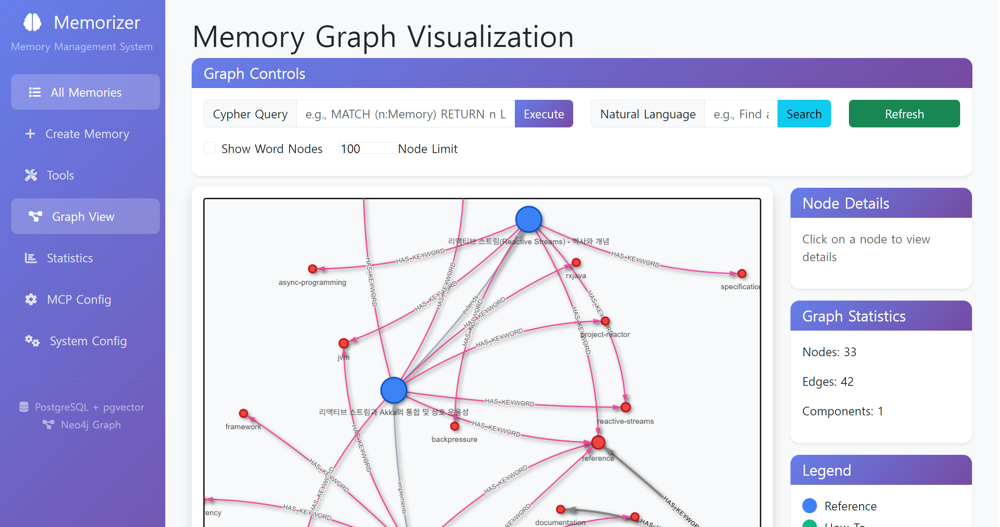
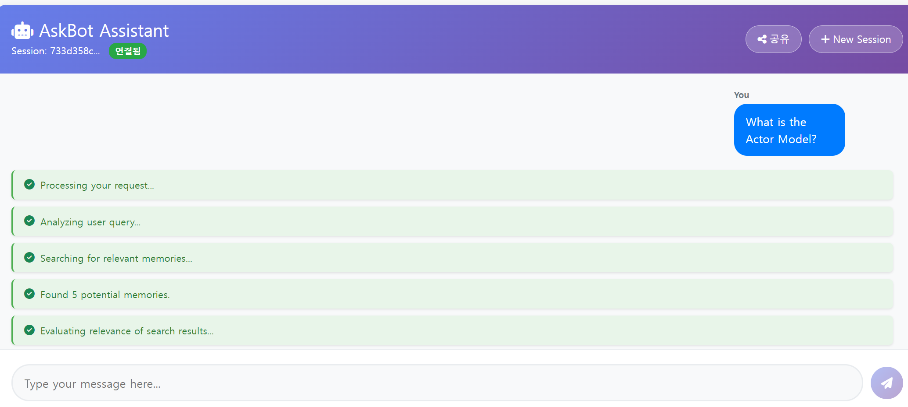
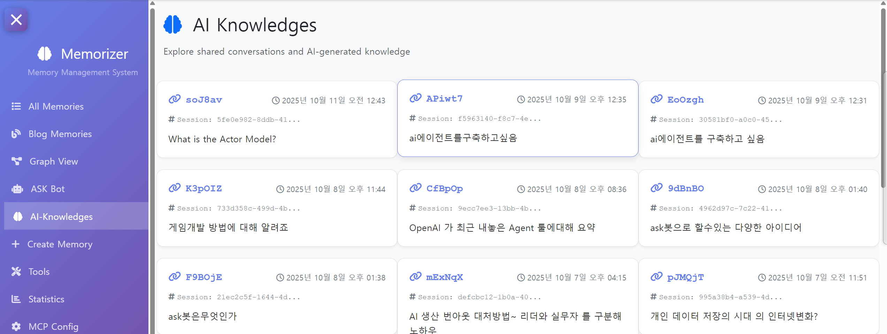

# Memorizer Extended



This project extends the capabilities of the **original Memorizer** by adding Graph functionality.



“It is possible to generate answers using the memory knowledge stored in ASKBOT.”



“The responses provided by ASKBOT can be regenerated as new memory.”

“In my personal memory space, I experiment with Vibe code centered around the actor model, along with various AI technologies and trends. All the extended features here are written entirely in Vibe. You can explore the organized content through the MCP blog.”

playground : https://mcp.webnori.com/ui/blog


# Memorizer Original

[](https://hub.docker.com/r/petabridge/memorizer)   

Memorizer is a .NET-based service that allows AI agents to store, retrieve, and search through memories using vector embeddings. It leverages PostgreSQL with the pgvector extension to provide efficient similarity search capabilities.

Key features:
- Store structured memories with vector embeddings
- Retrieve memories by ID
- Semantic search through memories using vector similarity
- Filter search results using tags
- Create relationships between memories to form knowledge graphs
- UI for manually adding, editing, deleting, or viewing memories
- MCP (Model Context Protocol) integration for easy use with AI agents

## Technologies

- .NET 9.0
- PostgreSQL with pgvector extension
- Model Context Protocol (MCP)
- ASP.NET Core
- [Akka.NET](https://getakka.net/) for background jobs, such as re-embedding memories if you change algorithms
- Npgsql for PostgreSQL connectivity

---

## Installation with Docker

### 🐳 Quick Start (Public Image)

The easiest way to get started is using the pre-built Docker image and our [`docker-compose.yml`](docker-compose.yml) file:

```bash
docker-compose up -d
```

This will:
- Download and run the latest [`petabridge/memorizer` image from Docker Hub](https://hub.docker.com/r/petabridge/memorizer)
- Start PostgreSQL with pgvector (port 5432)
- Start PgAdmin (port 5050)
- Start Ollama (port 11434)
- Start Memorizer API (port 5000)

**View the Memorizer Web UI on http://localhost:5000/ui**.

### 🚀 Local Development Builds

If you want to build and run from source:

#### Prerequisites
- Docker and Docker Compose
- .NET 9.0 SDK

#### 1. Build and Publish Local Container

```bash
# From solution root directory
# Build and publish the .NET container
dotnet publish -c Release /t:PublishContainer
```

This creates a container image named `memorizer:latest`.

#### 2. Start Infrastructure and Application

```bash
docker-compose -f docker-compose.local.yml up -d
```

This starts the same services but uses your locally built image.

---

## 🔌 MCP Configuration Example

To use Memorizer with any MCP-compatible client, add the following to your configuration (e.g., `mcp.json`):

```json
{
  "memorizer": {
    "url": "http://localhost:5000/sse"
  }
}
```

---

## 🖥️ Web UI

Memorizer includes a web-based user interface for managing memories through your browser.

### Access the Web UI

Once the application is running (via `docker-compose up -d`), you can access the Web UI at:

**http://localhost:5000/ui/**

### Features

- **Memory Management**: Create, view, edit, and delete memories
- **Search & Filter**: Search memories using semantic similarity and filter by tags
- **Statistics Dashboard**: View memory counts, tag distributions, and system statistics
- **MCP Configuration**: Get the MCP configuration JSON for connecting clients at `/ui/mcp-config`

The Web UI provides a user-friendly interface for all Memorizer functionality, making it easy to manage your AI agent's memory without needing to use the MCP tools directly.

---

## 🧠 Example System Prompt for LLMs

> [!IMPORTANT]
> **⚡ Pro Tip:** Add this system prompt to your `AGENT.md`, Cursor Rules files, or any AI agent configuration! This will dramatically improve how often and effectively your LLM uses the Memorizer service for persistent memory management.

> You have access to a long-term memory system via the Model Context Protocol (MCP) at the endpoint `memorizer`. Use the following tools:
>
> - `store`: Store a new memory. Parameters: `type`, `content` (markdown), `source`, `tags`, `confidence`, `relatedTo` (optional, memory ID), `relationshipType` (optional).
> - `search`: Search for similar memories. Parameters: `query`, `limit`, `minSimilarity`, `filterTags`.
> - `get`: Retrieve a memory by ID. Parameter: `id`.
> - `getMany`: Retrieve multiple memories by their IDs. Parameter: `ids` (list of IDs).
> - `delete`: Delete a memory by ID. Parameter: `id`.
> - `createRelationship`: Create a relationship between two memories. Parameters: `fromId`, `toId`, `type`.
>
> Use these tools to remember, recall, relate, and manage information as needed to assist the user. You can also manually retrieve or relate memories by their IDs when necessary.

---

## 📖 Documentation

- [Configuration & Advanced Setup](docs/configuration.md)
- [Local Development](docs/local-development.md)
- [Schema Migrations](docs/schema-migrations.md)
- [Architecture Decision Records](docs/adr/README.md)

## 📝 Version History

- Version 1.0.9 - [Dynamic Script Injection](prompt/en/19.InstallScript.md)
  - Added custom script configuration UI at `/ui/script-config`
  - Implemented dynamic script injection into page `<head>` section
  - Support for analytics scripts (Google Analytics, etc.) with in-memory caching
  - Database migration for script storage and management
- Version 1.0.8 - [Unit Test Upgrade](prompt/en/18.Unitest-Upgrade.md)
  - Enhanced actor model unit testing
  - Improved test coverage for ChatBotActor, SearchMemoryActor, and DecisionActor
- Version 1.0.7 - [ASKBot Actor Model Upgrade](prompt/en/17.ASKBOT-ActorModel-Upgrade.md)
  - Optimized conversation context management
  - Improved multi-session handling and SSE stability
- Version 1.0.6 - [ASKBot Improvements](prompt/en/15.03-ASKBOT-IMPROVE1.md)
  - Enhanced chatbot UI/UX
  - Added menu improvements and better conversation flow
- Version 1.0.5 - [ASKBot Websocket](prompt/en/15.02-ASKBOT-Websocket.md)
  - Implemented WebSocket support for real-time communication
  - Added SSE (Server-Sent Events) integration
- Version 1.0.4 - [ASKBot Actor Model](prompt/en/15.01-ASKBOT-ActorModel.md)
  - Introduced actor-based chatbot architecture
  - Implemented SearchMemoryActor and DecisionActor
- Version 1.0.3 - [Hybrid Search Upgrade](prompt/en/14-HybridSerch-Upgrade.md)
  - Enhanced search capabilities with hybrid approach
  - Combined vector and keyword search
- Version 1.0.2 - [Prompt Management Improvement](prompt/en/12.PROMPT-Improve.md)
  - Centralized prompt templates management
  - Consolidated and improved LLM instruction prompts

## License

MIT

---

## 💖 Attribution

Made with ❤️ by [psmon](https://wiki.webnori.com/display/AKKA/Akka-Home/)

Originally forked from [Petabridge](https://github.com/Aaronontheweb/memorizer-v1)
