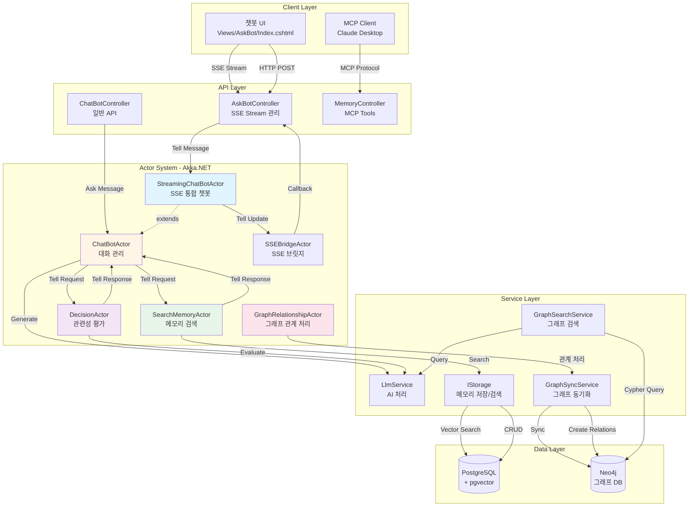
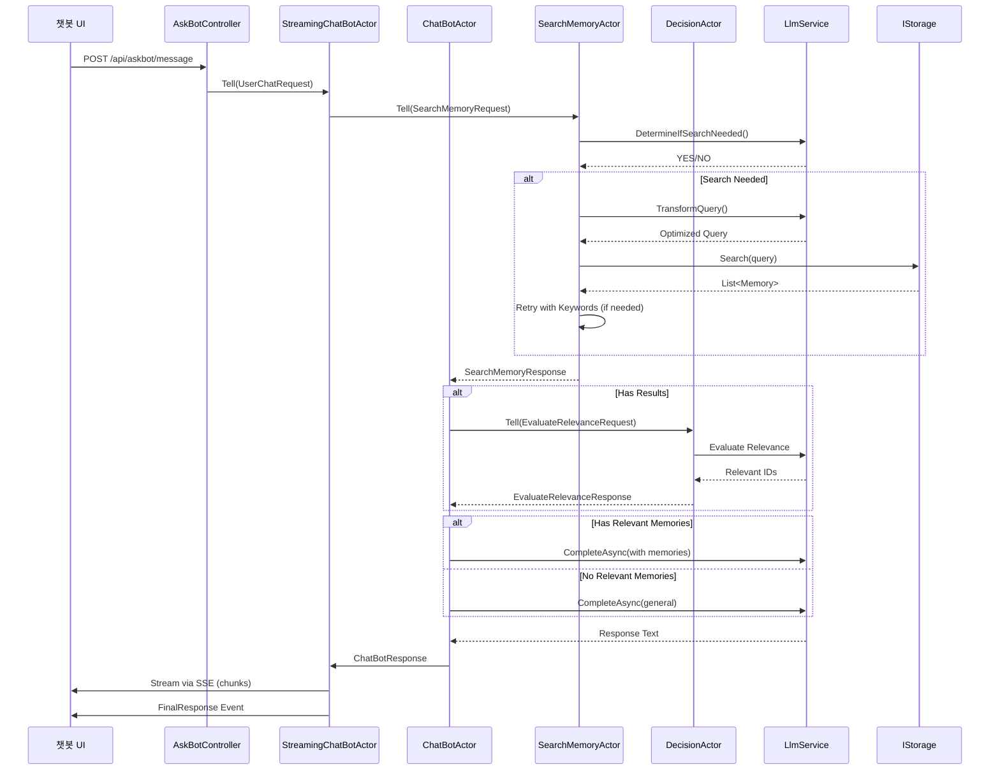
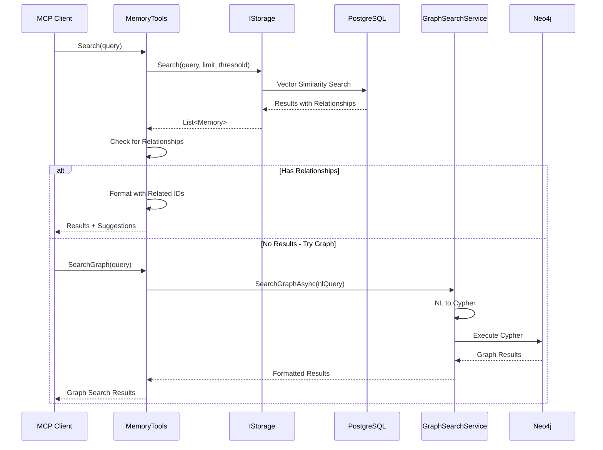

# 전체 아키텍처 및 구성요소

## 개요

Memorizer-v1은 RAG(Retrieval-Augmented Generation) 기법을 활용한 메모리 저장/검색 시스템으로, **MCP(Model Context Protocol)** 를 통한 외부 통합과 **액터 모델(Actor Model)** 기반의 독립형 챗봇 에이전트를 제공합니다.

## 핵심 특징

1. **RAG 기반 메모리 시스템**
   - PostgreSQL의 pgvector를 활용한 벡터 검색
   - Neo4j 그래프 DB를 통한 관계형 메모리 관리
   - 임베딩 기반 유사도 검색 및 키워드 검색

2. **MCP 통합**
   - Claude Desktop 등 MCP 클라이언트에서 직접 활용 가능
   - 메모리 검색, 저장, 관계 생성 등의 도구(Tools) 제공

3. **액터 모델 기반 챗봇**
   - Akka.NET을 사용한 분산 에이전트 아키텍처
   - SSE(Server-Sent Events)를 통한 실시간 스트리밍 응답
   - 메모리 검색, 의사결정, 그래프 관계 처리 등의 전문화된 액터들의 협업

## 시스템 아키텍처

## 레이어별 설명

### 1. Client Layer (클라이언트 계층)

#### 챗봇 UI
- **파일**: [Index.cshtml](https://github.com/psmon/memorizer-v1/blob/dev/src/Memorizer/Views/AskBot/Index.cshtml)
- **기능**:
  - SSE를 통한 실시간 스트리밍 응답 표시
  - Markdown 및 Mermaid 다이어그램 렌더링
  - 대화 이력 관리 및 세션 공유 기능
- **기술**: JavaScript, EventSource API, marked.js, mermaid.js

#### MCP Client
- **예시**: Claude Desktop, 기타 MCP 호환 클라이언트
- **통신**: MCP(Model Context Protocol)
- **기능**: 메모리 검색, 저장, 관계 생성 도구 활용

### 2. API Layer (API 계층)

#### AskBotController
- **파일**: [AskBotController.cs](https://github.com/psmon/memorizer-v1/blob/dev/src/Memorizer/Controllers/AskBotController.cs)
- **주요 엔드포인트**:
  - `GET /api/askbot/stream` - SSE 스트림 연결
  - `POST /api/askbot/message` - 채팅 메시지 전송
  - `POST /api/askbot/share` - 대화 공유 링크 생성
  - `GET /api/askbot/session/{sessionId}/history` - 대화 이력 조회
- **책임**: SSE 연결 관리, 액터와의 통신, 세션 관리

#### MemoryTools (MCP Interface)
- **파일**: [MemoryTools.cs](https://github.com/psmon/memorizer-v1/blob/dev/src/Memorizer/Tools/MemoryTools.cs)
- **제공 도구**:
  - `Store` - 메모리 저장
  - `Search` - 메모리 검색
  - `Get` / `GetMany` - 메모리 조회
  - `CreateRelationship` - 관계 생성
  - `SearchGraph` - 자연어 그래프 검색
  - `SearchGraphByCypher` - Cypher 쿼리 실행

### 3. Actor System (액터 시스템)

Akka.NET 기반의 분산 에이전트 시스템으로, 각 액터는 특정 책임을 가지고 메시지 기반으로 협업합니다.

#### StreamingChatBotActor
- **파일**: [AskBotController.cs#L1161-L1287](https://github.com/psmon/memorizer-v1/blob/dev/src/Memorizer/Controllers/AskBotController.cs#L1161-L1287)
- **역할**: ChatBotActor를 확장하여 SSE 스트리밍 지원
- **특징**:
  - 응답을 청크 단위로 스트리밍
  - 추론 단계를 실시간으로 전송
  - SSEBridgeActor를 통해 UI에 업데이트 전달

#### ChatBotActor
- **파일**: [ChatBotActor.cs](https://github.com/psmon/memorizer-v1/blob/dev/src/Memorizer/Actors/ChatBotActor.cs)
- **역할**: 사용자 세션 관리 및 대화 조정
- **기능**:
  - 대화 이력 관리 (최근 10개 교환)
  - 단기 메모리 관리 (컨텍스트 요약)
  - SearchMemoryActor 및 DecisionActor와 협업
  - 타임아웃 기반 세션 관리 (3일)

#### SearchMemoryActor
- **파일**: [SearchMemoryActor.cs](https://github.com/psmon/memorizer-v1/blob/dev/src/Memorizer/Actors/SearchMemoryActor.cs)
- **역할**: 메모리 검색 전문 액터
- **검색 전략**:
  1. 검색 필요성 판단 (LLM 활용)
  2. 쿼리 변환 및 최적화
  3. 벡터 유사도 검색
  4. 실패 시 키워드 기반 재시도 (최대 3회)

#### DecisionActor
- **파일**: [DecisionActor.cs](https://github.com/psmon/memorizer-v1/blob/dev/src/Memorizer/Actors/DecisionActor.cs)
- **역할**: 검색 결과의 관련성 평가
- **기능**:
  - 검색된 메모리와 사용자 쿼리의 관련성 판단
  - LLM을 활용한 관련 메모리 필터링
  - 관련 메모리 ID 리스트 반환

#### GraphRelationshipActor
- **파일**: [GraphRelationshipActor.cs](https://github.com/psmon/memorizer-v1/blob/dev/src/Memorizer/Actors/GraphRelationshipActor.cs)
- **역할**: 그래프 관계 처리
- **기능**:
  - 메모리 간 관계 제안
  - 관계 자동 생성
  - 배치 처리 지원

### 4. Service Layer (서비스 계층)

#### LlmService
- **파일**: [ILlmService.cs](https://github.com/psmon/memorizer-v1/blob/dev/src/Memorizer/Services/ILlmService.cs)
- **역할**: AI 모델과의 통신
- **지원 모델**: OpenAI GPT, Anthropic Claude
- **기능**: 텍스트 생성, 임베딩 생성, 스트리밍 응답

#### IStorage
- **파일**: [IStorage.cs](https://github.com/psmon/memorizer-v1/blob/dev/src/Memorizer/Services/IStorage.cs)
- **역할**: 메모리 저장 및 검색 추상화
- **구현체**: PostgreSQL + pgvector
- **기능**:
  - 벡터 유사도 검색
  - CRUD 작업
  - 관계 관리

#### GraphSyncService
- **파일**: [IGraphSyncService.cs](https://github.com/psmon/memorizer-v1/blob/dev/src/Memorizer/Services/IGraphSyncService.cs)
- **역할**: PostgreSQL과 Neo4j 간 동기화
- **기능**:
  - 메모리 노드 생성/업데이트
  - 키워드 노드 관리
  - 관계 생성 및 제안

#### GraphSearchService
- **파일**: [IGraphSearchService.cs](https://github.com/psmon/memorizer-v1/blob/dev/src/Memorizer/Services/IGraphSearchService.cs)
- **역할**: 그래프 검색 및 쿼리 처리
- **기능**:
  - 자연어를 Cypher 쿼리로 변환
  - 복잡한 그래프 패턴 검색
  - 관계 기반 지식 탐색

### 5. Data Layer (데이터 계층)

#### PostgreSQL + pgvector
- **용도**: 주 데이터 저장소
- **스키마**:
  - `memories` - 메모리 본문 및 메타데이터
  - `memory_embeddings` - 벡터 임베딩
  - `memory_relationships` - 메모리 간 관계
  - `askbot_share_links` - 공유 링크 정보

#### Neo4j
- **용도**: 지식 그래프 및 관계 분석
- **노드 타입**:
  - `Memory` - 메모리 노드
  - `Word` - 키워드 노드
- **관계 타입**:
  - `RELATES_TO` - 메모리 간 관계 (extends, supports, contradicts 등)
  - `HAS_KEYWORD` - 메모리-키워드 연결

## 데이터 흐름

### 1. 사용자 메시지 처리 흐름

### 2. MCP를 통한 메모리 검색 흐름

## 핵심 기술 스택

- **백엔드 프레임워크**: ASP.NET Core 8.0
- **액터 시스템**: Akka.NET
- **데이터베이스**:
  - PostgreSQL 16 (pgvector extension)
  - Neo4j 5.x
- **AI/ML**:
  - OpenAI API (GPT-4, text-embedding-ada-002)
  - Anthropic Claude API
- **프론트엔드**:
  - Razor Pages
  - JavaScript (EventSource, marked.js, mermaid.js)
  - Bootstrap 5

## 핵심 파일 위치

### 액터 시스템
- [ChatBotActor.cs](https://github.com/psmon/memorizer-v1/blob/dev/src/Memorizer/Actors/ChatBotActor.cs) - 대화 관리 액터
- [SearchMemoryActor.cs](https://github.com/psmon/memorizer-v1/blob/dev/src/Memorizer/Actors/SearchMemoryActor.cs) - 메모리 검색 액터
- [DecisionActor.cs](https://github.com/psmon/memorizer-v1/blob/dev/src/Memorizer/Actors/DecisionActor.cs) - 의사결정 액터
- [GraphRelationshipActor.cs](https://github.com/psmon/memorizer-v1/blob/dev/src/Memorizer/Actors/GraphRelationshipActor.cs) - 그래프 관계 처리 액터

### 컨트롤러
- [AskBotController.cs](https://github.com/psmon/memorizer-v1/blob/dev/src/Memorizer/Controllers/AskBotController.cs) - SSE 스트리밍 챗봇 API
- [ChatBotController.cs](https://github.com/psmon/memorizer-v1/blob/dev/src/Memorizer/Controllers/ChatBotController.cs) - 일반 챗봇 API

### 서비스
- [IStorage.cs](https://github.com/psmon/memorizer-v1/blob/dev/src/Memorizer/Services/IStorage.cs) - 메모리 저장 인터페이스
- [ILlmService.cs](https://github.com/psmon/memorizer-v1/blob/dev/src/Memorizer/Services/ILlmService.cs) - LLM 서비스 인터페이스
- [IGraphSyncService.cs](https://github.com/psmon/memorizer-v1/blob/dev/src/Memorizer/Services/IGraphSyncService.cs) - 그래프 동기화 서비스
- [IGraphSearchService.cs](https://github.com/psmon/memorizer-v1/blob/dev/src/Memorizer/Services/IGraphSearchService.cs) - 그래프 검색 서비스

### MCP 통합
- [MemoryTools.cs](https://github.com/psmon/memorizer-v1/blob/dev/src/Memorizer/Tools/MemoryTools.cs) - MCP 도구 구현

### 프롬프트
- [PromptTemplates.cs](https://github.com/psmon/memorizer-v1/blob/dev/src/Memorizer/Prompts/PromptTemplates.cs) - AI 프롬프트 템플릿

### UI
- [Index.cshtml](https://github.com/psmon/memorizer-v1/blob/dev/src/Memorizer/Views/AskBot/Index.cshtml) - 챗봇 인터페이스
