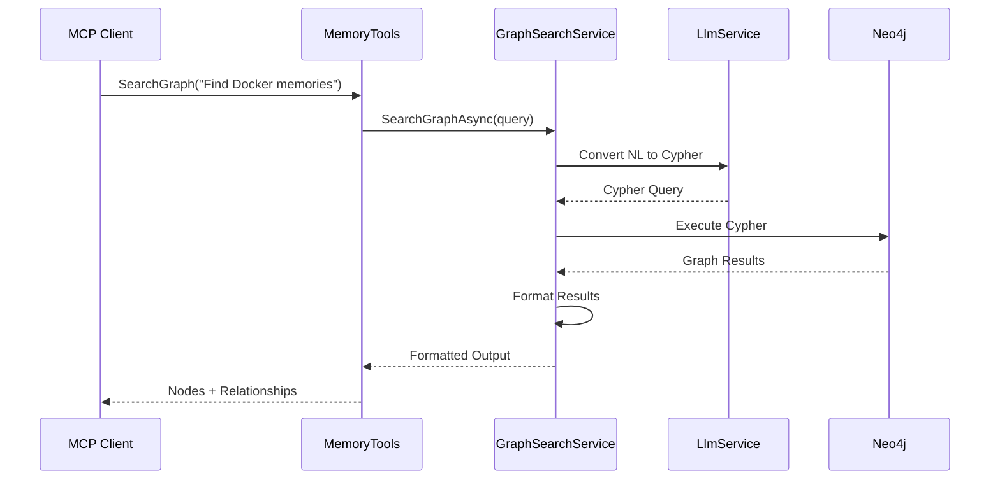
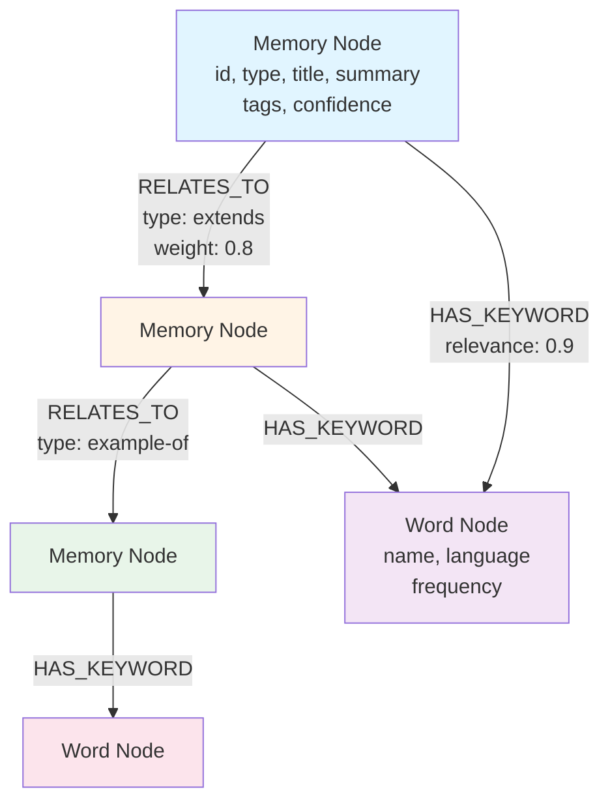
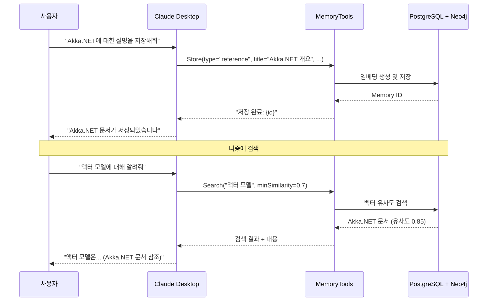
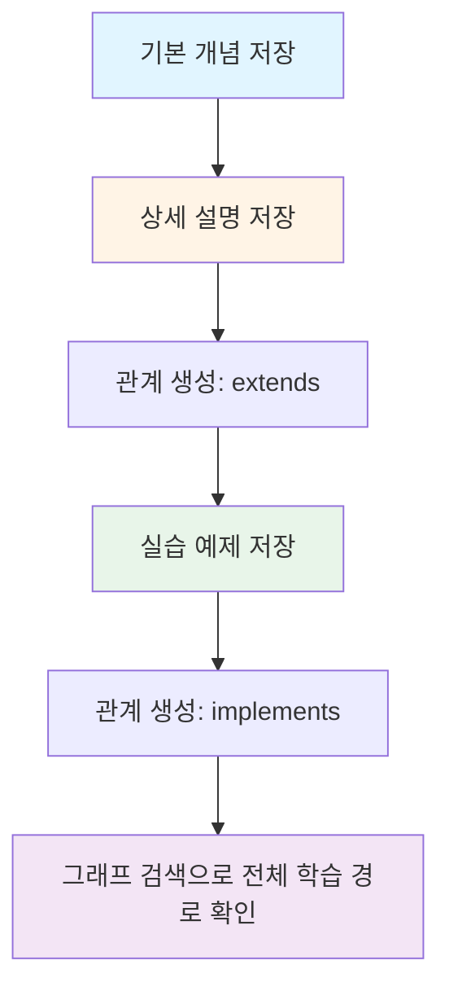

# MCP 기반 메모리 검색/저장 시스템

## 개요

Memorizer-v1은 **MCP(Model Context Protocol)** 를 통해 Claude Desktop 등의 AI 클라이언트에서 직접 활용할 수 있는 메모리 도구를 제공합니다. 벡터 검색과 그래프 DB를 결합하여 강력한 RAG 시스템을 구현했습니다.

## MCP 도구 개요

### 제공되는 도구 목록

| 도구 이름 | 설명 | 주요 파라미터 |
|---------|------|-------------|
| `Store` | 새로운 메모리 저장 | type, text, source, title, tags |
| `Search` | 유사도 기반 검색 | query, limit, minSimilarity, filterTags |
| `Get` | ID로 메모리 조회 | id |
| `GetMany` | 여러 메모리 일괄 조회 | ids[] |
| `Delete` | 메모리 삭제 | id |
| `CreateRelationship` | 메모리 간 관계 생성 | fromId, toId, type |
| `SearchGraph` | 자연어 그래프 검색 | query |
| `SearchGraphByCypher` | Cypher 쿼리 실행 | cypherQuery |

## 핵심 구현: MemoryTools.cs

**파일 위치**: [MemoryTools.cs](https://github.com/psmon/memorizer-v1/blob/dev/src/Memorizer/Tools/MemoryTools.cs)

### 1. Store - 메모리 저장

메모리를 PostgreSQL에 저장하고 선택적으로 관계를 생성합니다.

```csharp
[McpServerTool]
public async Task<string> Store(
    string type,      // 'conversation', 'reference', 'how-to', 'document'
    string text,      // 저장할 본문 (markdown 지원)
    string source,    // 'user', 'system', 'LLM'
    string title,     // 제목 (필수)
    string[]? tags = null,           // 태그
    double confidence = 1.0,         // 신뢰도
    Guid? relatedTo = null,          // 관련 메모리 ID
    string? relationshipType = null, // 관계 타입
    CancellationToken cancellationToken = default
)
```

**주요 기능**:
- 자동 임베딩 생성 및 저장
- 선택적 관계 생성
- Neo4j와 자동 동기화

**사용 예시**:
```json
{
  "type": "reference",
  "text": "# Akka.NET Actor Model\n\nAkka.NET은 .NET용 액터 모델 프레임워크입니다...",
  "source": "LLM",
  "title": "Akka.NET 액터 모델 개요",
  "tags": ["akka", "actor-model", "dotnet"],
  "confidence": 0.95
}
```

### 2. Search - 유사도 기반 검색

벡터 임베딩을 활용한 의미론적 검색을 수행합니다.

```csharp
[McpServerTool]
public async Task<string> Search(
    string query,                    // 검색 쿼리
    int limit = 10,                  // 최대 결과 수
    double minSimilarity = 0.7,      // 최소 유사도 (0.0~1.0)
    string[]? filterTags = null,     // 태그 필터
    CancellationToken cancellationToken = default
)
```

**검색 전략**:
1. **주 검색**: 벡터 유사도 검색
2. **폴백 검색**: 결과가 없으면 유사도 임계값을 10% 낮춰 재시도
3. **관계 제안**: 검색 결과에 연관된 메모리 ID를 함께 반환

**핵심 코드** ([MemoryTools.cs#L62-L220](https://github.com/psmon/memorizer-v1/blob/dev/src/Memorizer/Tools/MemoryTools.cs#L62-L220)):

```csharp
// 검색 수행
List<Memory> memories = await _storage.Search(
    query,
    limit,
    minSimilarity,
    filterTags,
    cancellationToken
);

// 결과가 없으면 폴백 검색
if (memories.Count == 0 && minSimilarity > 0.0)
{
    double fallbackThreshold = Math.Max(0.0, minSimilarity - 0.1);
    memories = await _storage.Search(
        query,
        limit,
        fallbackThreshold,
        filterTags,
        cancellationToken
    );
}

// 관련 메모리 ID 수집 및 제안
var relatedMemoryIds = new HashSet<Guid>();
foreach (var memory in memories)
{
    if (memory.Relationships is { Count: > 0 })
    {
        foreach (var rel in memory.Relationships)
        {
            // 관련 메모리 ID 수집
            if (rel.FromMemoryId != memory.Id)
                relatedMemoryIds.Add(rel.FromMemoryId);
            if (rel.ToMemoryId != memory.Id)
                relatedMemoryIds.Add(rel.ToMemoryId);
        }
    }
}

// 제안 메시지 추가
if (relatedMemoryIds.Count > 0)
{
    result.AppendLine("💡 Suggestion: These memories have relationships to other memories.");
    result.AppendLine($"Consider using GetMany with these IDs: [{string.Join(", ", relatedMemoryIds)}]");
}
```

### 3. GetMany - 관련 메모리 일괄 조회

검색 결과에서 제안된 관련 메모리들을 효율적으로 조회합니다.

```csharp
[McpServerTool]
public async Task<string> GetMany(
    Guid[] ids,
    CancellationToken cancellationToken = default
)
```

**워크플로우**:


### 4. SearchGraph - 자연어 그래프 검색

자연어 쿼리를 Cypher로 변환하여 Neo4j 그래프를 검색합니다.

```csharp
[McpServerTool]
public async Task<string> SearchGraph(
    string query,  // 자연어 쿼리
    CancellationToken cancellationToken = default
)
```

**지원하는 쿼리 유형**:

1. **타입 기반 검색**
   - "Find all reference documents"
   - "Show how-to guides"

2. **키워드 및 태그 검색**
   - "Find memories about Docker or Kubernetes"
   - "Show memories related to AI"

3. **관계 탐색**
   - "Find memories that extend DDD concepts"
   - "Show enhanced versions"
   - "Find examples of patterns"

4. **고급 분석**
   - "Find the most connected memories"
   - "Show most frequent keywords"
   - "Recent high-confidence memories"

**구현 흐름** ([MemoryTools.cs#L468-L624](https://github.com/psmon/memorizer-v1/blob/dev/src/Memorizer/Tools/MemoryTools.cs#L468-L624)):



### 5. SearchGraphByCypher - 직접 Cypher 실행

고급 사용자를 위한 직접 Cypher 쿼리 실행 기능입니다.

```csharp
[McpServerTool]
public async Task<string> SearchGraphByCypher(
    string cypherQuery,
    CancellationToken cancellationToken = default
)
```

**안전 장치**:
- READ-ONLY 쿼리만 허용 (CREATE, DELETE 등 차단)
- LIMIT 자동 추가 (지정하지 않으면 100으로 제한)

**예시 쿼리**:

```cypher
// 허브 노드 찾기 (연결이 많은 메모리)
MATCH (m:Memory)
WITH m, SIZE([(m)-[]-() | 1]) as degree
WHERE degree > 3
RETURN m, degree ORDER BY degree DESC LIMIT 20
```

```cypher
// 공통 키워드를 가진 메모리 찾기
MATCH (m1:Memory)-[:HAS_KEYWORD]->(w:Word)<-[:HAS_KEYWORD]-(m2:Memory)
WHERE id(m1) < id(m2)
WITH m1, m2, COLLECT(DISTINCT w.name) as common_keywords
WHERE SIZE(common_keywords) > 2
RETURN m1, m2, common_keywords
```

## 벡터 검색 및 그래프 DB 활용

### PostgreSQL + pgvector: 벡터 검색

**임베딩 생성 및 저장**:


**유사도 검색 쿼리** (구현 위치: [IStorage.cs](https://github.com/psmon/memorizer-v1/blob/dev/src/Memorizer/Services/IStorage.cs)):

```sql
SELECT
    m.id,
    m.type,
    m.title,
    m.text,
    m.source,
    m.tags,
    m.confidence,
    m.created_at,
    1 - (e.embedding <=> @queryEmbedding) as similarity
FROM memories m
INNER JOIN memory_embeddings e ON m.id = e.memory_id
WHERE 1 - (e.embedding <=> @queryEmbedding) >= @minSimilarity
ORDER BY e.embedding <=> @queryEmbedding
LIMIT @limit;
```

**주요 연산자**:
- `<=>` : 코사인 거리 (cosine distance)
- `1 - (embedding <=> @queryEmbedding)` : 유사도 점수 (0~1)

### Neo4j: 지식 그래프

**그래프 스키마**:



**노드 속성**:

**Memory 노드**:
```json
{
  "id": "uuid",
  "type": "reference | how-to | conversation | document",
  "title": "제목",
  "summary": "요약 또는 전체 텍스트",
  "tags": ["tag1", "tag2"],
  "confidence": 0.0~1.0,
  "source": "LLM | user | system",
  "createdAt": "ISO datetime"
}
```

**Word 노드**:
```json
{
  "name": "키워드",
  "language": "ko | en",
  "frequency": 사용 빈도,
  "createdAt": "ISO datetime",
  "updatedAt": "ISO datetime"
}
```

**관계 타입**:

| 관계 | 의미 | 사용 예 |
|-----|------|--------|
| `extends` | 개념 확장 | 기본 개념 → 상세 설명 |
| `enhanced-version` | 개선 버전 | 초기 버전 → 업데이트 버전 |
| `supports` | 지원/보완 | 주장 → 근거 |
| `contradicts` | 모순/반대 | 의견 A → 반대 의견 B |
| `implements` | 구현 | 이론 → 실습 예제 |
| `references` | 참조 | 본문 → 참고 자료 |
| `example-of` | 예시 | 실제 사례 → 패턴 |
| `explains` | 설명 | 상세 설명 → 개념 |

## 프롬프트 템플릿

**파일 위치**: [PromptTemplates.cs](https://github.com/psmon/memorizer-v1/blob/dev/src/Memorizer/Prompts/PromptTemplates.cs)

### 1. 그래프 쿼리 생성 프롬프트

자연어를 Cypher 쿼리로 변환하는 프롬프트입니다.

**핵심 부분** ([PromptTemplates.cs#L119-L214](https://github.com/psmon/memorizer-v1/blob/dev/src/Memorizer/Prompts/PromptTemplates.cs#L119-L214)):

```csharp
public static string CreateGraphQueryPrompt(string naturalLanguageQuery)
{
    var prompt = new StringBuilder();

    prompt.AppendLine("You are a Neo4j Cypher query expert.");
    prompt.AppendLine("Convert the following natural language query to a precise Cypher query.");

    // 스키마 설명
    prompt.AppendLine("## Graph Database Schema");
    prompt.AppendLine("### Nodes");
    prompt.AppendLine("1. **Memory Node** - id, type, source, title, summary, tags, confidence");
    prompt.AppendLine("2. **Word Node** - name, language, frequency");

    // 관계 설명
    prompt.AppendLine("### Relationships");
    prompt.AppendLine("1. **RELATES_TO** (Memory -> Memory) - type, weight");
    prompt.AppendLine("2. **HAS_KEYWORD** (Memory -> Word) - relevance");

    // 예시 쿼리들
    prompt.AppendLine("## Examples:");
    prompt.AppendLine("- 'Find all reference documents' -> MATCH (m:Memory {type: 'reference'}) ...");
    prompt.AppendLine("- 'Find memories about Docker' -> MATCH (m:Memory)-[:HAS_KEYWORD]->(w:Word) ...");

    // 실제 사용자 쿼리
    prompt.AppendLine($"## Natural Language Query: {naturalLanguageQuery}");

    // 중요 지침
    prompt.AppendLine("## IMPORTANT INSTRUCTIONS");
    prompt.AppendLine("1. Return ONLY a valid Neo4j Cypher query");
    prompt.AppendLine("2. Do NOT include any explanations or markdown");

    return prompt.ToString();
}
```

### 2. 관계 분석 프롬프트

메모리 간 관계를 제안하는 프롬프트입니다 ([PromptTemplates.cs#L219-L254](https://github.com/psmon/memorizer-v1/blob/dev/src/Memorizer/Prompts/PromptTemplates.cs#L219-L254)):

```csharp
public static string CreateRelationshipAnalysisPrompt(
    string sourceTitle,
    string sourceType,
    string sourceContent,
    List<(Guid id, string title, string type, double similarity)> candidates)
{
    var prompt = new StringBuilder();

    prompt.AppendLine("Analyze the following memory and suggest relationships.");
    prompt.AppendLine($"Source Memory: {sourceTitle} ({sourceType})");

    prompt.AppendLine("Candidate Memories:");
    for (int i = 0; i < candidates.Count; i++)
    {
        var candidate = candidates[i];
        prompt.AppendLine($"{i + 1}. {candidate.title} ({candidate.type})");
    }

    prompt.AppendLine("Suggest relationship types from:");
    prompt.AppendLine("- extends, supports, contradicts, implements");
    prompt.AppendLine("- references, related-to, example-of, explains");

    prompt.AppendLine("Return as JSON array:");
    prompt.AppendLine("[{\"targetIndex\": 1, \"type\": \"extends\", \"confidence\": 0.8}]");

    return prompt.ToString();
}
```

## 텔레메트리 및 로깅

**구현 위치**: [MemoryTools.cs](https://github.com/psmon/memorizer-v1/blob/dev/src/Memorizer/Tools/MemoryTools.cs)

### Activity 추적

OpenTelemetry를 사용한 분산 추적:

```csharp
using var activity = TelemetryConfig.ActivitySource.StartActivity("MemoryTools.Search");

// 쿼리 세부사항 기록
activity?.AddEvent(new ActivityEvent("query.details", DateTimeOffset.UtcNow,
    new ActivityTagsCollection
    {
        {"query.text", query},
        {"query.limit", limit.ToString()},
        {"query.minSimilarity", minSimilarity.ToString()}
    }));

// 폴백 검색 시 이벤트 추가
activity?.AddEvent(new ActivityEvent("fallback.search", DateTimeOffset.UtcNow,
    new ActivityTagsCollection
    {
        {"fallback.threshold", fallbackThreshold.ToString()},
        {"original.threshold", minSimilarity.ToString()}
    }));

// 최종 상태 설정
activity?.SetStatus(ActivityStatusCode.Ok, $"Found {memories.Count} results");
```

### 구조화된 로깅

```csharp
_logger.LogInformation(
    "Memory search completed. Query: {Query}, ResultCount: {ResultCount}, Threshold: {Threshold}",
    query, memories.Count, minSimilarity
);

// 각 결과에 대한 상세 로그
foreach (var memory in memories)
{
    var relevancyScore = 100 * (1 - memory.Similarity.Value);
    _logger.LogInformation(
        "Search result: MemoryId: {MemoryId}, Title: {Title}, RelevancyScore: {RelevancyScore:F1}%, RelationshipCount: {RelationshipCount}",
        memory.Id, memory.Title, relevancyScore, memory.Relationships?.Count ?? 0
    );
}
```

## 사용 시나리오

### 시나리오 1: 기술 문서 저장 및 검색



### 시나리오 2: 관계 기반 지식 탐색



## 모범 사례

### 1. 효과적인 메모리 저장

✅ **권장사항**:
- 명확하고 설명적인 제목 사용
- 관련 태그를 3-7개 정도 추가
- 적절한 메모리 타입 선택 (reference, how-to, document 등)
- 충분한 컨텍스트 포함 (markdown 활용)

```json
{
  "type": "how-to",
  "title": "Akka.NET으로 분산 시스템 구축하기",
  "text": "# 개요\n\n## 1단계: 액터 정의\n...",
  "tags": ["akka", "distributed-system", "tutorial", "dotnet"],
  "confidence": 0.9
}
```

❌ **피해야 할 사항**:
- 너무 짧거나 불명확한 제목
- 태그 없음 또는 너무 많은 태그
- 컨텍스트 부족

### 2. 효과적인 검색

✅ **권장사항**:
- 구체적인 검색어 사용
- 적절한 유사도 임계값 설정 (0.6~0.8)
- 태그 필터 활용
- 관련 메모리 제안 활용 (GetMany)

```typescript
// 1단계: 초기 검색
const results = await Search("Akka.NET 액터 생명주기", 5, 0.7, ["akka"]);

// 2단계: 관련 메모리 조회
const relatedIds = extractRelatedIds(results);
const relatedMemories = await GetMany(relatedIds);
```

### 3. 관계 활용

✅ **권장사항**:
- 논리적으로 연관된 메모리 간 관계 생성
- 적절한 관계 타입 선택
- 양방향 탐색 가능하도록 설계

```typescript
// 개념 확장
CreateRelationship(basicConceptId, detailedExplanationId, "extends");

// 이론과 실습 연결
CreateRelationship(theoryId, practicalExampleId, "implements");

// 시리즈 문서 연결
CreateRelationship(part1Id, part2Id, "continues-to");
```

## 참고 자료

- [MemoryTools.cs 전체 소스](https://github.com/psmon/memorizer-v1/blob/dev/src/Memorizer/Tools/MemoryTools.cs)
- [PromptTemplates.cs](https://github.com/psmon/memorizer-v1/blob/dev/src/Memorizer/Prompts/PromptTemplates.cs)
- [IStorage.cs 인터페이스](https://github.com/psmon/memorizer-v1/blob/dev/src/Memorizer/Services/IStorage.cs)
- [IGraphSearchService.cs](https://github.com/psmon/memorizer-v1/blob/dev/src/Memorizer/Services/IGraphSearchService.cs)
