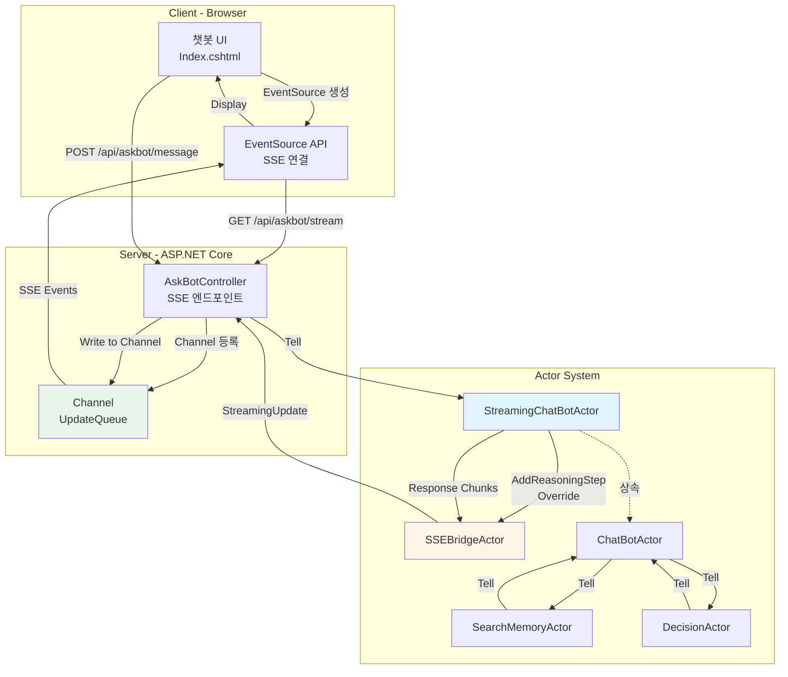
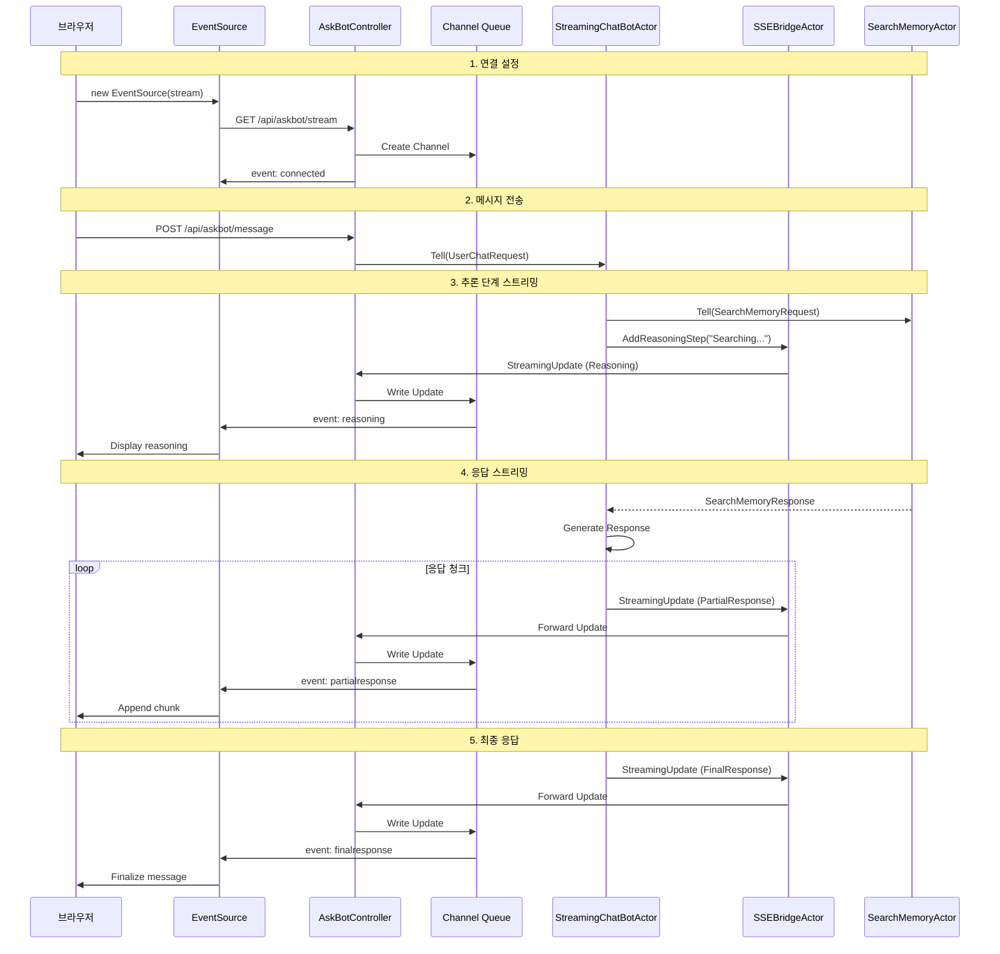

# SSE와 액터 모델 연동: 실시간 스트리밍 챗봇

## 개요

Memorizer-v1의 챗봇은 **SSE(Server-Sent Events)** 와 **Akka.NET 액터 시스템**을 결합하여 실시간 스트리밍 응답을 제공합니다. 이를 통해 사용자는 AI의 사고 과정과 중간 결과를 실시간으로 확인할 수 있습니다.

## SSE (Server-Sent Events)란?

SSE는 서버에서 클라이언트로 실시간 이벤트를 푸시하는 HTTP 기반 프로토콜입니다.

### SSE vs WebSocket

| 특성 | SSE | WebSocket |
|-----|-----|-----------|
| **통신 방향** | 단방향 (서버 → 클라이언트) | 양방향 |
| **프로토콜** | HTTP | WebSocket (별도 프로토콜) |
| **재연결** | 자동 | 수동 처리 필요 |
| **구현 복잡도** | 낮음 | 높음 |
| **사용 사례** | 실시간 알림, 스트리밍 응답 | 채팅, 실시간 게임 |

**선택 이유**: 챗봇의 경우 서버에서 클라이언트로의 단방향 스트리밍이 주요 요구사항이므로, 구현이 간단하고 HTTP 기반인 SSE가 적합합니다.

## 시스템 아키텍처



## 구현 상세

### 1. 서버 측: SSE 엔드포인트

**파일**: [AskBotController.cs](https://github.com/psmon/memorizer-v1/blob/dev/src/Memorizer/Controllers/AskBotController.cs)

#### SSE 스트림 생성 ([AskBotController.cs#L55-L140](https://github.com/psmon/memorizer-v1/blob/dev/src/Memorizer/Controllers/AskBotController.cs#L55-L140))

```csharp
[HttpGet("stream")]
public async Task StreamChat([FromQuery] string? sessionId = null)
{
    sessionId = GetOrCreateSessionId(sessionId);
    var connectionId = Guid.NewGuid().ToString();

    // SSE 헤더 설정
    Response.Headers.Append("Content-Type", "text/event-stream");
    Response.Headers.Append("Cache-Control", "no-cache");
    Response.Headers.Append("Connection", "keep-alive");
    Response.Headers.Append("X-Accel-Buffering", "no");  // nginx 버퍼링 비활성화

    // 채널 생성 (unbounded queue)
    var channel = Channel.CreateUnbounded<StreamingUpdate>(new UnboundedChannelOptions
    {
        SingleReader = true,   // 하나의 SSE 연결만 읽음
        SingleWriter = false   // 여러 액터가 쓸 수 있음
    });

    // 세션별 채널 등록
    var sessionConnections = SessionChannels.GetOrAdd(
        sessionId,
        _ => new ConcurrentDictionary<string, Channel<StreamingUpdate>>()
    );
    sessionConnections[connectionId] = channel;

    try
    {
        // 초기 연결 이벤트 전송
        await WriteSSEEvent("connected", new { sessionId, connectionId, timestamp = DateTime.UtcNow });

        // 채널에서 업데이트 읽어서 SSE로 전송
        await foreach (var update in channel.Reader.ReadAllAsync(HttpContext.RequestAborted))
        {
            if (update.UpdateType == StreamUpdateType.FinalResponse)
            {
                var finalData = JsonSerializer.Deserialize<JsonElement>(update.Content);
                await WriteSSEEvent("finalresponse", finalData);
            }
            else
            {
                await WriteSSEEvent(update.UpdateType.ToString().ToLower(), new
                {
                    sessionId = update.SessionId,
                    content = update.Content,
                    timestamp = update.Timestamp
                });
            }

            await Response.Body.FlushAsync();  // 즉시 전송
        }
    }
    catch (OperationCanceledException)
    {
        // 클라이언트 연결 종료
        _logger.LogInformation("SSE connection closed for session {SessionId}", sessionId);
    }
    finally
    {
        // 채널 정리
        if (sessionConnections.TryRemove(connectionId, out _))
        {
            if (sessionConnections.IsEmpty)
            {
                SessionChannels.TryRemove(sessionId, out _);
            }
        }
        channel.Writer.TryComplete();
    }
}
```

#### SSE 이벤트 작성 ([AskBotController.cs#L734-L746](https://github.com/psmon/memorizer-v1/blob/dev/src/Memorizer/Controllers/AskBotController.cs#L734-L746))

```csharp
private async Task WriteSSEEvent(string eventType, object data)
{
    var json = JsonSerializer.Serialize(data, new JsonSerializerOptions
    {
        PropertyNamingPolicy = JsonNamingPolicy.CamelCase
    });

    // SSE 포맷: event: {type}\ndata: {json}\n\n
    var message = $"event: {eventType}\ndata: {json}\n\n";
    var bytes = Encoding.UTF8.GetBytes(message);

    await Response.Body.WriteAsync(bytes, 0, bytes.Length);
    await Response.Body.FlushAsync();
}
```

#### 세션 브로드캐스트 ([AskBotController.cs#L716-L732](https://github.com/psmon/memorizer-v1/blob/dev/src/Memorizer/Controllers/AskBotController.cs#L716-L732))

```csharp
private async Task BroadcastToSession(string sessionId, StreamingUpdate update)
{
    if (SessionChannels.TryGetValue(sessionId, out var sessionConnections))
    {
        var connectionCount = sessionConnections.Count;
        if (connectionCount > 0)
        {
            _logger.LogDebug(
                "Broadcasting to session {SessionId} with {ConnectionCount} connections: {UpdateType}",
                sessionId, connectionCount, update.UpdateType
            );

            // 모든 연결된 클라이언트에게 전송
            var tasks = sessionConnections.Values.Select(channel =>
                channel.Writer.TryWrite(update) ? Task.CompletedTask : Task.CompletedTask
            );
            await Task.WhenAll(tasks);
        }
    }
}
```

### 2. 액터 시스템: StreamingChatBotActor

**파일**: [AskBotController.cs#L1161-L1287](https://github.com/psmon/memorizer-v1/blob/dev/src/Memorizer/Controllers/AskBotController.cs#L1161-L1287)

#### 액터 생성 ([AskBotController.cs#L1061-L1081](https://github.com/psmon/memorizer-v1/blob/dev/src/Memorizer/Controllers/AskBotController.cs#L1061-L1081))

```csharp
private IActorRef GetOrCreateChatBotActor(string sessionId)
{
    return SessionActors.GetOrAdd(sessionId, sid =>
    {
        // 1. SSE 브릿지 액터 생성
        var sseBridgeProps = SSEBridgeActor.Props(sid, async update =>
        {
            await BroadcastToSession(sid, update);
        });
        var sseBridgeActor = _actorSystem.ActorOf(sseBridgeProps, $"sse-bridge-{sid}");

        // 2. StreamingChatBotActor 생성 (SSE 브릿지 주입)
        var props = StreamingChatBotActor.Props(
            sid,
            _searchMemoryActor,
            _decisionActor,
            _llmService,
            sseBridgeActor
        );
        var actor = _actorSystem.ActorOf(props, $"askbot-{sid}");

        return actor;
    });
}
```

#### StreamingChatBotActor 구현

```csharp
public sealed class StreamingChatBotActor : ChatBotActor
{
    private readonly IActorRef _sseBridge;
    private readonly string _sessionId;

    public StreamingChatBotActor(
        string sessionId,
        IActorRef searchMemoryActor,
        IActorRef decisionActor,
        ILlmService llmService,
        IActorRef sseBridge)
        : base(sessionId, searchMemoryActor, decisionActor, llmService)
    {
        _sessionId = sessionId;
        _sseBridge = sseBridge;
    }

    // 추론 단계를 SSE로 스트리밍
    protected override void AddReasoningStep(string step)
    {
        base.AddReasoningStep(step);

        _sseBridge.Tell(new StreamingUpdate
        {
            SessionId = _sessionId,
            UpdateType = StreamUpdateType.Reasoning,
            Content = step
        });
    }

    // 응답을 청크 단위로 스트리밍
    protected override void HandleChatBotResponseFromPipeTo(ChatBotResponse response)
    {
        // 메시지를 5글자씩 분할하여 스트리밍
        StreamResponseMessageAsync(response);
    }

    private async void StreamResponseMessageAsync(ChatBotResponse response)
    {
        var chunks = SplitIntoChunks(response.Message, 5);

        foreach (var chunk in chunks)
        {
            _sseBridge.Tell(new StreamingUpdate
            {
                SessionId = _sessionId,
                UpdateType = StreamUpdateType.PartialResponse,
                Content = chunk
            });

            await Task.Delay(10);  // 타이핑 효과
        }

        // 최종 메타데이터 전송
        _sseBridge.Tell(new StreamingUpdate
        {
            SessionId = _sessionId,
            UpdateType = StreamUpdateType.FinalResponse,
            Content = JsonSerializer.Serialize(new
            {
                sessionId = _sessionId,
                type = response.Type.ToString(),
                referencedMemoryIds = response.ReferencedMemoryIds ?? new List<Guid>(),
                hasMemorySearch = response.Type == ResponseType.MemoryBased
            })
        });
    }
}
```

### 3. SSEBridgeActor

**파일**: [AskBotController.cs#L1125-L1156](https://github.com/psmon/memorizer-v1/blob/dev/src/Memorizer/Controllers/AskBotController.cs#L1125-L1156)

```csharp
public sealed class SSEBridgeActor : ReceiveActor
{
    private readonly string _sessionId;
    private readonly Func<StreamingUpdate, Task> _forwardUpdate;
    private readonly ILoggingAdapter _logger;

    public SSEBridgeActor(string sessionId, Func<StreamingUpdate, Task> forwardUpdate)
    {
        _sessionId = sessionId;
        _forwardUpdate = forwardUpdate;
        _logger = Context.GetLogger();

        ReceiveAsync<StreamingUpdate>(HandleStreamingUpdate);
    }

    private async Task HandleStreamingUpdate(StreamingUpdate update)
    {
        try
        {
            await _forwardUpdate(update);  // BroadcastToSession 호출
        }
        catch (Exception ex)
        {
            _logger.Error(ex, "Error forwarding streaming update for session {0}", _sessionId);
        }
    }

    public static Props Props(string sessionId, Func<StreamingUpdate, Task> forwardUpdate)
    {
        return Akka.Actor.Props.Create(() => new SSEBridgeActor(sessionId, forwardUpdate));
    }
}
```

### 4. 클라이언트 측: JavaScript 구현

**파일**: [Index.cshtml](https://github.com/psmon/memorizer-v1/blob/dev/src/Memorizer/Views/AskBot/Index.cshtml)

#### SSE 연결 생성 ([Index.cshtml#L518-L604](https://github.com/psmon/memorizer-v1/blob/dev/src/Memorizer/Views/AskBot/Index.cshtml#L518-L604))

```javascript
function connectSSE() {
    updateConnectionStatus('connecting');

    // 기존 연결 종료
    if (eventSource) {
        eventSource.close();
        eventSource = null;
    }

    // 새 SSE 연결 생성
    eventSource = new EventSource(`/api/askbot/stream?sessionId=${sessionId}`);

    // 연결 이벤트 리스너
    eventSource.addEventListener('connected', function(event) {
        const data = JSON.parse(event.data);
        console.log('Connected to SSE:', data);
        updateConnectionStatus('connected');
    });

    // 추론 단계 이벤트
    eventSource.addEventListener('reasoning', function(event) {
        const data = JSON.parse(event.data);
        if (hasMemorySearch) {
            addReasoningStep(data.content);
        }
    });

    // 검색 진행 이벤트
    eventSource.addEventListener('searchprogress', function(event) {
        const data = JSON.parse(event.data);
        hasMemorySearch = true;
        addReasoningStep(data.content);
    });

    // 부분 응답 이벤트 (스트리밍)
    eventSource.addEventListener('partialresponse', function(event) {
        const data = JSON.parse(event.data);
        appendToCurrentMessage(data.content);
    });

    // 최종 응답 이벤트
    eventSource.addEventListener('finalresponse', function(event) {
        const data = JSON.parse(event.data);

        if (data.referencedMemoryIds && data.referencedMemoryIds.length > 0) {
            referencedMemoryIds = data.referencedMemoryIds;
        }

        if (data.hasMemorySearch) {
            hasMemorySearch = true;
        }

        if (!hasMemorySearch) {
            hideReasoningSteps();
        }

        finalizeCurrentMessage();
        isProcessing = false;
        enableInput();
    });

    // 에러 이벤트
    eventSource.addEventListener('error', function(event) {
        const data = JSON.parse(event.data);
        appendToCurrentMessage('\n\n❌ ' + data.content);
        finalizeCurrentMessage();
        isProcessing = false;
        enableInput();
    });

    // 연결 에러 처리
    eventSource.onerror = function(error) {
        console.error('SSE Error:', error);
        updateConnectionStatus('disconnected');

        // 3초 후 재연결
        setTimeout(() => {
            if (!eventSource || eventSource.readyState === EventSource.CLOSED) {
                connectSSE();
            }
        }, 3000);
    };
}
```

#### 메시지 전송 ([Index.cshtml#L631-L682](https://github.com/psmon/memorizer-v1/blob/dev/src/Memorizer/Views/AskBot/Index.cshtml#L631-L682))

```javascript
async function sendMessage() {
    const input = document.getElementById('message-input');
    const message = input.value.trim();

    if (!message || isProcessing) return;

    // UI에 사용자 메시지 추가
    addUserMessage(message);

    input.value = '';
    disableInput();
    isProcessing = true;

    // 상태 초기화
    currentAssistantMessage = null;
    currentMessageContent = '';
    referencedMemoryIds = [];
    processedReasoningSteps.clear();
    hasMemorySearch = false;

    clearWelcomeMessage();
    showTypingIndicator();

    try {
        // HTTP POST로 메시지 전송 (응답은 SSE로 수신)
        const response = await fetch('/api/askbot/message', {
            method: 'POST',
            headers: {
                'Content-Type': 'application/json',
            },
            body: JSON.stringify({
                message: message,
                sessionId: sessionId
            })
        });

        if (!response.ok) {
            throw new Error('Failed to send message');
        }

        // 실제 응답은 SSE 이벤트로 수신됨
    } catch (error) {
        console.error('Error sending message:', error);
        hideTypingIndicator();
        addErrorMessage('Failed to send message. Please try again.');
        isProcessing = false;
        enableInput();
    }
}
```

#### 실시간 UI 업데이트 ([Index.cshtml#L698-L828](https://github.com/psmon/memorizer-v1/blob/dev/src/Memorizer/Views/AskBot/Index.cshtml#L698-L828))

```javascript
function addReasoningStep(step) {
    // 중복 방지
    const stepKey = `${sessionId}-${step}`;
    if (processedReasoningSteps.has(stepKey)) {
        return;
    }
    processedReasoningSteps.add(stepKey);

    const messagesContainer = document.getElementById('chat-messages');
    const typingIndicator = document.getElementById('typing-indicator');
    const reasoningDiv = document.createElement('div');
    reasoningDiv.className = 'reasoning-step';
    reasoningDiv.setAttribute('data-reasoning', 'true');
    reasoningDiv.innerHTML = `
        <div class="d-flex align-items-center">
            <i class="fas fa-check-circle text-success me-2"></i>
            <span>${escapeHtml(step)}</span>
        </div>
    `;

    // 타이핑 인디케이터 앞에 삽입
    if (typingIndicator) {
        messagesContainer.insertBefore(reasoningDiv, typingIndicator);
    } else {
        messagesContainer.appendChild(reasoningDiv);
    }
    scrollToBottom();
}

function appendToCurrentMessage(content) {
    hideTypingIndicator();

    if (!currentAssistantMessage) {
        messageCounter++;
        const messagesContainer = document.getElementById('chat-messages');
        currentAssistantMessage = document.createElement('div');
        currentAssistantMessage.className = 'message assistant';
        currentAssistantMessage.innerHTML = `
            <div>
                <div class="message-label">AskBot</div>
                <div class="message-content" id="message-content-${messageCounter}"></div>
            </div>
        `;
        messagesContainer.appendChild(currentAssistantMessage);
    }

    currentMessageContent += content;
    const contentElement = currentAssistantMessage.querySelector('.message-content');
    contentElement.innerHTML = renderMarkdown(currentMessageContent);
    scrollToBottom();
}

async function finalizeCurrentMessage() {
    if (currentAssistantMessage) {
        const contentElement = currentAssistantMessage.querySelector('.message-content');

        // Markdown 렌더링 (Mermaid 다이어그램 포함)
        await renderMarkdownContent(currentMessageContent, contentElement);

        // 메모리 참조 링크 추가
        addMemoryReferenceLinks(contentElement);

        currentAssistantMessage = null;
        currentMessageContent = '';
    }
}
```

## 이벤트 타입

### StreamUpdateType 열거형

```csharp
public enum StreamUpdateType
{
    Connected,         // 연결 확인
    Reasoning,         // 추론 단계
    SearchProgress,    // 검색 진행 상황
    PartialResponse,   // 부분 응답 (스트리밍)
    FinalResponse,     // 최종 응답
    Error             // 에러
}
```

### StreamingUpdate 구조

```csharp
public class StreamingUpdate
{
    public string SessionId { get; set; }
    public StreamUpdateType UpdateType { get; set; }
    public string Content { get; set; }
    public DateTime Timestamp { get; set; } = DateTime.UtcNow;
}
```

## 메시지 흐름

### 전체 시퀀스 다이어그램



## 성능 최적화

### 1. Channel 사용

**왜 Channel을 사용하는가?**
- Thread-safe한 생산자-소비자 패턴
- Backpressure 처리 (자동 흐름 제어)
- 메모리 효율적인 비동기 큐

```csharp
// Unbounded Channel 설정
var channel = Channel.CreateUnbounded<StreamingUpdate>(new UnboundedChannelOptions
{
    SingleReader = true,   // SSE 연결 하나만 읽음
    SingleWriter = false   // 여러 액터가 쓸 수 있음
});
```

### 2. 다중 연결 지원

동일한 세션에 여러 브라우저 탭이 연결 가능:

```csharp
// 세션별로 여러 연결 관리
private static readonly ConcurrentDictionary<
    string,  // sessionId
    ConcurrentDictionary<string, Channel<StreamingUpdate>>  // connectionId -> channel
> SessionChannels = new();
```

### 3. 청크 크기 조절

```csharp
// 5글자씩 스트리밍 (타이핑 효과)
var chunks = SplitIntoChunks(response.Message, 5);

// 10ms 지연 (자연스러운 타이핑 속도)
await Task.Delay(10);
```

## 에러 처리 및 재연결

### 서버 측

```csharp
try
{
    await foreach (var update in channel.Reader.ReadAllAsync(HttpContext.RequestAborted))
    {
        await WriteSSEEvent(update.UpdateType.ToString().ToLower(), ...);
        await Response.Body.FlushAsync();
    }
}
catch (OperationCanceledException)
{
    // 클라이언트가 연결을 끊음 (정상)
    _logger.LogInformation("SSE connection closed for session {SessionId}", sessionId);
}
finally
{
    // 리소스 정리
    sessionConnections.TryRemove(connectionId, out _);
    channel.Writer.TryComplete();
}
```

### 클라이언트 측

```javascript
eventSource.onerror = function(error) {
    console.error('SSE Error:', error);
    updateConnectionStatus('disconnected');

    // 자동 재연결 (3초 후)
    setTimeout(() => {
        if (!eventSource || eventSource.readyState === EventSource.CLOSED) {
            connectSSE();
        }
    }, 3000);
};
```

## 세션 관리

### 세션 ID 생성 및 저장

```javascript
function getSessionId() {
    // 1. localStorage에서 확인
    let storedId = localStorage.getItem('askbot-session-id');
    if (storedId) {
        return storedId;
    }

    // 2. 새 ID 생성
    const newId = generateUUID();
    localStorage.setItem('askbot-session-id', newId);
    return newId;
}
```

### 세션 정보 표시

```javascript
function updateSessionInfo() {
    const sessionInfo = document.getElementById('session-info');
    if (sessionInfo && sessionId) {
        // 처음 8자만 표시
        sessionInfo.textContent = `Session: ${sessionId.substring(0, 8)}...`;
    }
}
```

## UI 컴포넌트

### 1. 타이핑 인디케이터

```css
.thinking-wave {
    display: flex;
    align-items: center;
    gap: 4px;
}

.thinking-wave .dot {
    width: 8px;
    height: 8px;
    border-radius: 50%;
    background: linear-gradient(135deg, #667eea 0%, #764ba2 100%);
    animation: wave 1.4s ease-in-out infinite;
}

@keyframes wave {
    0%, 60%, 100% {
        transform: translateY(0);
        opacity: 0.4;
    }
    30% {
        transform: translateY(-10px);
        opacity: 1;
    }
}
```

### 2. 추론 단계 표시

```css
.reasoning-step {
    padding: 10px 15px;
    background: #e8f5e9;
    border-left: 3px solid #4caf50;
    margin-bottom: 10px;
    border-radius: 6px;
    animation: fadeIn 0.5s ease;
}

@keyframes fadeIn {
    from { opacity: 0; }
    to { opacity: 1; }
}
```

### 3. 연결 상태 표시

```javascript
function updateConnectionStatus(status) {
    const statusBadge = document.getElementById('status-badge');
    statusBadge.className = `status-badge ${status}`;

    switch(status) {
        case 'connected':
            statusBadge.textContent = '연결됨';
            break;
        case 'disconnected':
            statusBadge.textContent = '접속끊김';
            break;
        case 'connecting':
            statusBadge.textContent = '연결중...';
            break;
    }
}
```

## 참고 자료

- [AskBotController.cs - SSE 구현](https://github.com/psmon/memorizer-v1/blob/dev/src/Memorizer/Controllers/AskBotController.cs)
- [Index.cshtml - 클라이언트 구현](https://github.com/psmon/memorizer-v1/blob/dev/src/Memorizer/Views/AskBot/Index.cshtml)
- [ChatBotActor.cs - 기본 액터](https://github.com/psmon/memorizer-v1/blob/dev/src/Memorizer/Actors/ChatBotActor.cs)
- [SSE Specification (MDN)](https://developer.mozilla.org/en-US/docs/Web/API/Server-sent_events)
- [System.Threading.Channels (Microsoft Docs)](https://docs.microsoft.com/en-us/dotnet/api/system.threading.channels)
