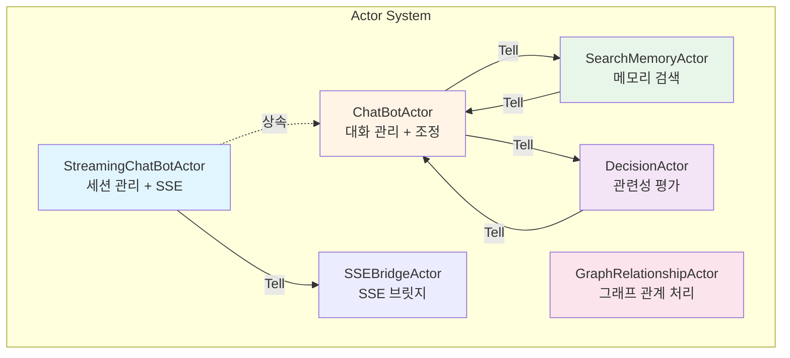
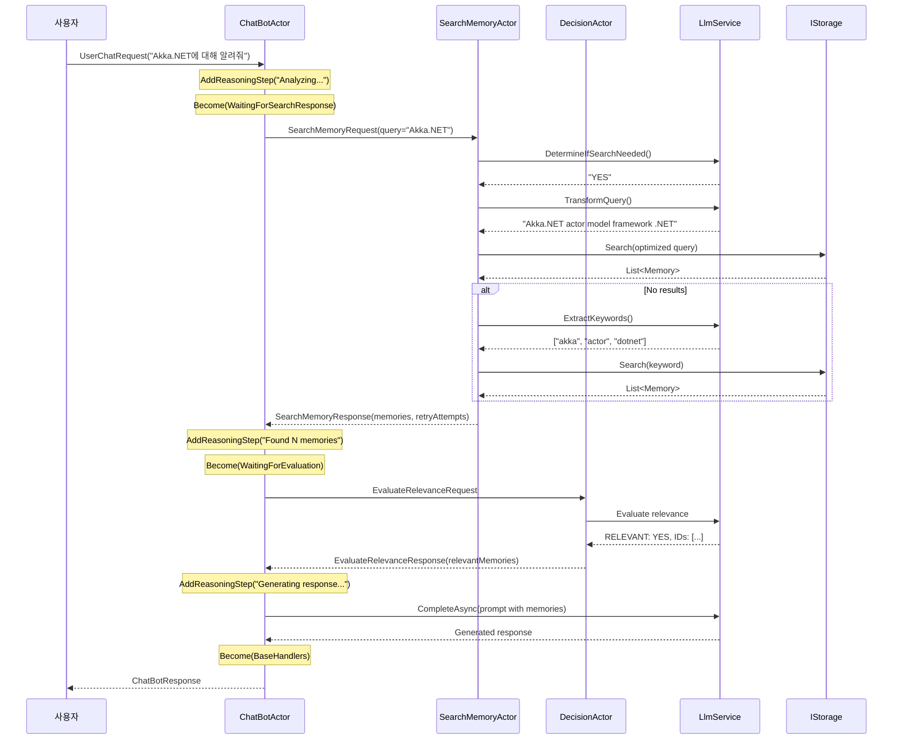

# 액터 모델 기반 챗봇 에이전트: 협업 구조와 프롬프트

## 개요

Memorizer-v1의 챗봇은 **Akka.NET 액터 모델**을 기반으로 구현되어, 각 액터가 특정 역할을 수행하며 메시지를 통해 협업합니다. 이를 통해 확장 가능하고 결함 허용성이 높은 시스템을 구축했습니다.

## 액터 모델이란?

### 핵심 개념

액터 모델은 분산 시스템을 위한 동시성 모델로, 다음과 같은 특징이 있습니다:

1. **격리된 상태**: 각 액터는 자신만의 상태를 가지며, 외부에서 직접 접근 불가
2. **메시지 기반 통신**: 액터 간 통신은 메시지를 통해서만 이루어짐
3. **비동기 처리**: 메시지는 비동기적으로 전송되고 처리됨
4. **계층 구조**: 액터는 자식 액터를 생성하고 감독(supervise)할 수 있음

### 왜 액터 모델인가?

| 요구사항 | 액터 모델의 해결책 |
|----------|-------------------|
| 동시성 처리 | 각 액터가 독립적으로 메시지 처리 |
| 상태 관리 | 액터별 격리된 상태 관리 |
| 확장성 | 새로운 액터 추가로 기능 확장 |
| 결함 허용성 | Supervisor 패턴으로 에러 처리 |
| 비동기 처리 | 기본적으로 비동기 메시지 전송 |

## 액터 시스템 구조



## 액터별 상세 설명

### 1. ChatBotActor - 대화 관리자

**파일**: [ChatBotActor.cs](https://github.com/psmon/memorizer-v1/blob/dev/src/Memorizer/Actors/ChatBotActor.cs)

#### 역할과 책임

- 사용자 세션 관리
- 대화 히스토리 유지 (최근 10개 교환)
- 단기 메모리 관리 (컨텍스트 요약)
- 다른 액터들의 조정자 역할
- 세션 타임아웃 관리 (3일)

#### 상태 관리

```csharp
public class ChatBotActor : ReceiveActor
{
    private readonly string _sessionId;

    // 대화 이력 (최대 10개)
    protected readonly List<ConversationEntry> _conversationEntries = new();

    // 단기 메모리 (최대 500자)
    protected string _shortTermMemory = string.Empty;

    // 마지막 중요 응답 (최대 300자)
    protected string _lastImportantResponse = string.Empty;

    // 추론 단계
    private readonly List<StreamingUpdate> _reasoningSteps = new();

    // 타이머
    public ITimerScheduler Timers { get; set; }
    private const string SessionTimerKey = "session-timeout";
    private static readonly TimeSpan SessionTimeout = TimeSpan.FromDays(3);
}
```

#### 메시지 핸들러

```csharp
public ChatBotActor(
    string sessionId,
    IActorRef searchMemoryActor,
    IActorRef decisionActor,
    ILlmService llmService)
{
    _sessionId = sessionId;
    _searchMemoryActor = searchMemoryActor;
    _decisionActor = decisionActor;
    _llmService = llmService;

    // 메시지 핸들러 등록
    Receive<UserChatRequest>(HandleUserChatRequest);
    Receive<SearchMemoryResponse>(HandleSearchMemoryResponse);
    Receive<EvaluateRelevanceResponse>(HandleEvaluateRelevanceResponse);
    Receive<SessionTimeout>(HandleSessionTimeout);
    Receive<ChatBotResponse>(HandleChatBotResponseFromPipeTo);

    // 세션 타이머 시작
    ResetSessionTimer();
}
```

#### 사용자 요청 처리 흐름

```csharp
private void HandleUserChatRequest(UserChatRequest request)
{
    // 1. 세션 타이머 리셋
    ResetSessionTimer();

    // 2. 대화 이력에 추가
    _conversationHistory.Add($"User: {request.Message}");

    // 3. 추론 단계 초기화
    _reasoningSteps.Clear();
    AddReasoningStep("Analyzing user query...");

    // 4. 검색 요청 생성
    var searchRequest = new SearchMemoryRequest
    {
        Query = request.Message,
        SessionId = request.SessionId,
        MaxResults = 5,
        MinSimilarity = 0.3
    };

    AddReasoningStep("Searching for relevant memories...");

    // 5. Become을 사용한 상태 전환 (응답 대기 상태로)
    Context.Become(WaitingForSearchResponse(request, Sender));

    // 6. SearchMemoryActor에게 검색 요청
    _searchMemoryActor.Tell(searchRequest, Self);
}
```

#### Become 패턴을 사용한 상태 관리

```csharp
private Receive WaitingForSearchResponse(UserChatRequest originalRequest, IActorRef originalSender)
{
    return message =>
    {
        if (message is SearchMemoryResponse searchResponse)
        {
            HandleSearchMemoryResponseContinuation(searchResponse, originalRequest, originalSender);
            return true;
        }
        // 다른 메시지 타입도 처리 (SessionTimeout, ResetSessionTimer 등)
        // ...
        return false;
    };
}

private void HandleSearchMemoryResponseContinuation(
    SearchMemoryResponse searchResponse,
    UserChatRequest originalRequest,
    IActorRef originalSender)
{
    if (searchResponse.Memories.Count == 0)
    {
        AddReasoningStep("No relevant memories found.");
        GenerateGeneralResponse(originalRequest, originalSender);
        SetupBaseHandlers();  // 기본 상태로 복귀
    }
    else
    {
        AddReasoningStep($"Found {searchResponse.Memories.Count} potential memories.");
        AddReasoningStep("Evaluating relevance of search results...");

        // DecisionActor에게 관련성 평가 요청
        var evaluateRequest = new EvaluateRelevanceRequest
        {
            SessionId = originalRequest.SessionId,
            Query = originalRequest.Message,
            Memories = searchResponse.Memories
        };

        Context.Become(WaitingForEvaluationResponse(originalRequest, originalSender));
        _decisionActor.Tell(evaluateRequest, Self);
    }
}
```

#### 프롬프트: 일반 응답 생성

```csharp
private const string GeneralResponsePrompt = @"
You are a helpful AI assistant named ASKBot. You are having a conversation with a user.

{1}  // 대화 컨텍스트

Current User Query: {0}

Provide a helpful and concise response that takes the conversation context into account.
Be conversational and maintain continuity with previous exchanges.";
```

#### 프롬프트: 메모리 기반 응답 생성

```csharp
private const string MemoryBasedResponsePrompt = @"
You are a helpful AI assistant named ASKBot with access to stored memories.
You are having a conversation with a user.

{2}  // 대화 컨텍스트

Current User Query: {0}

Relevant Information from Memory:
{1}  // 검색된 메모리 내용

Based on the conversation context and the relevant information,
provide a comprehensive and accurate answer to the user's query.
Maintain conversation continuity and reference previous context when appropriate.";
```

#### 컨텍스트 생성

```csharp
private string GenerateConversationContext()
{
    var sb = new StringBuilder();

    // 1. 단기 메모리 (중요한 정보)
    if (!string.IsNullOrWhiteSpace(_shortTermMemory))
    {
        sb.AppendLine("Session Context (Important Information):");
        sb.AppendLine(_shortTermMemory);
        sb.AppendLine();
    }

    // 2. 마지막 중요 응답
    if (!string.IsNullOrWhiteSpace(_lastImportantResponse)
        && _lastImportantResponse.Length > 50)
    {
        sb.AppendLine("Previous Response Context:");
        sb.AppendLine(_lastImportantResponse);
        sb.AppendLine();
    }

    // 3. 최근 대화 이력 (최근 3개)
    if (_conversationEntries.Any())
    {
        sb.AppendLine("Recent Conversation:");
        foreach (var entry in _conversationEntries.TakeLast(3))
        {
            sb.AppendLine($"User: {entry.UserMessage}");
            sb.AppendLine($"Assistant: {entry.BotResponse}");
            sb.AppendLine();
        }
    }

    return sb.ToString();
}
```

### 2. SearchMemoryActor - 검색 전문가

**파일**: [SearchMemoryActor.cs](https://github.com/psmon/memorizer-v1/blob/dev/src/Memorizer/Actors/SearchMemoryActor.cs)

#### 역할과 책임

- 검색 필요성 판단
- 쿼리 최적화
- 벡터 유사도 검색 수행
- 실패 시 키워드 기반 재시도

#### 메시지 핸들러

```csharp
public SearchMemoryActor(IStorage storage, ILlmService llmService)
{
    _storage = storage;
    _llmService = llmService;

    ReceiveAsync<SearchMemoryRequest>(HandleSearchMemoryRequest);
}
```

#### 검색 프롬프트 1: 검색 필요성 판단

```csharp
private const string SearchRequiredPrompt = @"
Analyze the following user query and determine if a memory search is needed.
A search is ALWAYS needed if the user is asking about:
- Technical concepts, frameworks, or technologies (e.g., Docker, Kubernetes, Reactive Streams, etc.)
- Programming languages, libraries, or tools
- Specific information that might be stored
- Past conversations or knowledge
- Technical details, documentation, or how-to guides
- Any reference to stored information
- Explanations about specific topics (using words like '알려줘', '설명해', 'tell me about', 'explain')

A search is NOT needed ONLY for:
- Simple greetings like '안녕' or 'hello' without other content
- Questions about the chatbot system itself (like '너는 누구야?')
- Meta commands to the chatbot

User Query: {0}

Respond with only 'YES' if search is needed, or 'NO' if not needed.";
```

#### 검색 프롬프트 2: 쿼리 변환

```csharp
private const string QueryTransformPrompt = @"
Transform the following user query into an optimized search query for memory retrieval.
Focus on extracting key concepts and technical terms.

IMPORTANT:
- If the query contains technical terms in Korean, include BOTH Korean and English versions
- For example: 'Reactive Stream' should become 'Reactive Streams Reactive Stream 리액티브 스트림'
- Include common variations and related terms

Original Query: {0}

Provide only the transformed search query with all relevant terms, nothing else.";
```

#### 검색 프롬프트 3: 키워드 추출

```csharp
private const string KeywordExtractionPrompt = @"
Extract 3-5 key keywords from the following query for search purposes.
Include both English and Korean versions of technical terms where applicable.
Focus on the most important concepts.

Query: {0}

Provide keywords separated by commas, nothing else.";
```

#### 검색 전략 구현

```csharp
private async Task HandleSearchMemoryRequest(SearchMemoryRequest request)
{
    // 1단계: 검색 필요성 판단
    var searchNeeded = await DetermineIfSearchNeeded(request.Query);
    _logger.LogInfo("Search needed: {0}", searchNeeded);

    if (!searchNeeded)
    {
        Sender.Tell(new SearchMemoryResponse
        {
            SessionId = request.SessionId,
            Memories = new List<Memory>(),
            SearchPerformed = false
        });
        return;
    }

    // 2단계: 쿼리 변환
    var transformedQuery = await TransformQuery(request.Query);
    _logger.LogInfo("Transformed query: {0} -> {1}", request.Query, transformedQuery);

    // 3단계: 벡터 유사도 검색
    var adjustedSimilarity = Math.Min(request.MinSimilarity, 0.2);
    var memories = await _storage.Search(
        transformedQuery,
        request.MaxResults,
        adjustedSimilarity,
        null
    );

    var retryAttempts = 0;
    var extractedKeywords = new List<string>();

    // 4단계: 결과가 없으면 키워드 기반 재시도 (최대 3회)
    if (memories.Count == 0 && retryAttempts < 3)
    {
        _logger.LogDebug("No results found, attempting keyword search");
        extractedKeywords = await ExtractKeywords(request.Query);

        foreach (var keyword in extractedKeywords.Take(3))
        {
            if (memories.Count > 0) break;

            retryAttempts++;
            _logger.LogDebug("Retry attempt {0} with keyword: {1}", retryAttempts, keyword);

            memories = await _storage.Search(
                keyword,
                request.MaxResults,
                adjustedSimilarity,
                null
            );
        }
    }

    // 5단계: 결과 반환
    Sender.Tell(new SearchMemoryResponse
    {
        SessionId = request.SessionId,
        OriginalQuery = request.Query,
        TransformedQuery = transformedQuery,
        Memories = memories,
        SearchPerformed = true,
        RetryAttempts = retryAttempts,
        ExtractedKeywords = extractedKeywords
    });
}
```

### 3. DecisionActor - 관련성 평가자

**파일**: [DecisionActor.cs](https://github.com/psmon/memorizer-v1/blob/dev/src/Memorizer/Actors/DecisionActor.cs)

#### 역할과 책임

- 검색 결과의 관련성 평가
- 관련 메모리 필터링
- 평가 근거 제공

#### 관련성 평가 프롬프트

```csharp
private const string RelevanceEvaluationPrompt = @"
You are evaluating whether the following search results are relevant to answer the user's query.
BE INCLUSIVE - if the memory contains ANY information about the topic, consider it relevant.

User Query: {0}

Search Results:
{1}

Analyze each search result and determine:
1. Does the memory contain ANY information about the topic mentioned in the query?
2. Could this information be useful for answering the question, even partially?
3. Is the memory about the same general subject area?

For technical queries (like 'Reactive Streams', 'Docker', 'Kubernetes', etc.),
if a memory contains information about that technology, it IS relevant.

Respond in the following format:
RELEVANT: YES or NO
REASONING: Brief explanation of your decision(한글로답변)
RELEVANT_IDS: Comma-separated list of relevant memory IDs (if any)";
```

#### 평가 로직

```csharp
private async Task HandleEvaluateRelevanceRequest(EvaluateRelevanceRequest request)
{
    // 메모리가 없으면 즉시 반환
    if (request.Memories.Count == 0)
    {
        Sender.Tell(new EvaluateRelevanceResponse
        {
            SessionId = request.SessionId,
            HasRelevantMemories = false,
            RelevantMemories = null,
            Reasoning = "No memories found to evaluate"
        });
        return;
    }

    // 메모리 포맷팅
    var memoriesText = FormatMemoriesForEvaluation(request.Memories);

    // LLM으로 관련성 평가
    var prompt = string.Format(RelevanceEvaluationPrompt, request.Query, memoriesText);
    var llmResponse = await _llmService.CompleteAsync(prompt);

    // 응답 파싱
    var (hasRelevant, reasoning, relevantIds) = ParseRelevanceResponse(llmResponse);

    // 관련 메모리 필터링
    List<Memory>? relevantMemories = null;
    if (hasRelevant && relevantIds.Count > 0)
    {
        relevantMemories = request.Memories
            .Where(m => relevantIds.Contains(m.Id))
            .ToList();
    }

    Sender.Tell(new EvaluateRelevanceResponse
    {
        SessionId = request.SessionId,
        HasRelevantMemories = hasRelevant,
        RelevantMemories = relevantMemories,
        Reasoning = reasoning
    });
}
```

### 4. GraphRelationshipActor - 그래프 관계 처리자

**파일**: [GraphRelationshipActor.cs](https://github.com/psmon/memorizer-v1/blob/dev/src/Memorizer/Actors/GraphRelationshipActor.cs)

#### 역할과 책임

- 메모리 간 관계 제안
- 관계 자동 생성
- 배치 처리

#### 메시지 핸들러

```csharp
public GraphRelationshipActor(
    IGraphSyncService graphSyncService,
    ILlmService llmService,
    ILogger<GraphRelationshipActor> logger)
{
    _graphSyncService = graphSyncService;
    _llmService = llmService;
    _logger = logger;

    ReceiveAsync<ProcessMemoryForRelationships>(HandleProcessMemory);
    ReceiveAsync<CreateRelationshipsFromSuggestions>(HandleCreateRelationships);
    ReceiveAsync<BatchProcessMemories>(HandleBatchProcess);
}
```

#### 관계 처리 로직

```csharp
private async Task HandleProcessMemory(ProcessMemoryForRelationships message)
{
    // 1. 관계 제안 받기
    var suggestions = await _graphSyncService.SuggestRelationshipsAsync(message.MemoryId);

    // 2. 자동 생성 옵션이 켜져 있으면 관계 생성
    if (suggestions.Any() && message.AutoCreate)
    {
        foreach (var suggestion in suggestions.Where(s => s.Weight >= message.MinConfidence))
        {
            await _graphSyncService.CreateGraphRelationshipAsync(
                suggestion.FromId,
                suggestion.ToId,
                suggestion.Type,
                new Dictionary<string, object> { ["weight"] = suggestion.Weight }
            );

            _logger.LogInformation(
                "Created relationship: {FromId} -{Type}-> {ToId} (weight: {Weight})",
                suggestion.FromId, suggestion.Type, suggestion.ToId, suggestion.Weight
            );
        }
    }

    // 3. 결과 반환
    Sender.Tell(new RelationshipProcessingResult
    {
        MemoryId = message.MemoryId,
        Success = true,
        SuggestionsCount = suggestions.Count,
        CreatedCount = message.AutoCreate
            ? suggestions.Count(s => s.Weight >= message.MinConfidence)
            : 0
    });
}
```

## 액터 간 메시지 흐름

### 전체 시퀀스 다이어그램



## 메시지 타입 정의

### UserChatRequest

```csharp
public class UserChatRequest
{
    public string SessionId { get; set; }
    public string Message { get; set; }
    public string UserId { get; set; }
}
```

### SearchMemoryRequest / Response

```csharp
public class SearchMemoryRequest
{
    public string SessionId { get; set; }
    public string Query { get; set; }
    public int MaxResults { get; set; } = 5;
    public double MinSimilarity { get; set; } = 0.3;
}

public class SearchMemoryResponse
{
    public string SessionId { get; set; }
    public string OriginalQuery { get; set; }
    public string? TransformedQuery { get; set; }
    public List<Memory> Memories { get; set; }
    public bool SearchPerformed { get; set; }
    public int RetryAttempts { get; set; }
    public List<string> ExtractedKeywords { get; set; }
}
```

### EvaluateRelevanceRequest / Response

```csharp
public class EvaluateRelevanceRequest
{
    public string SessionId { get; set; }
    public string Query { get; set; }
    public List<Memory> Memories { get; set; }
}

public class EvaluateRelevanceResponse
{
    public string SessionId { get; set; }
    public bool HasRelevantMemories { get; set; }
    public List<Memory>? RelevantMemories { get; set; }
    public string Reasoning { get; set; }
}
```

### ChatBotResponse

```csharp
public class ChatBotResponse
{
    public string SessionId { get; set; }
    public string Message { get; set; }
    public ResponseType Type { get; set; }  // MemoryBased, General, Error
    public List<Guid>? ReferencedMemoryIds { get; set; }
    public List<string> ReasoningSteps { get; set; }
    public DateTime Timestamp { get; set; } = DateTime.UtcNow;
}

public enum ResponseType
{
    MemoryBased,  // 메모리 기반 응답
    General,      // 일반 LLM 응답
    Error         // 에러
}
```

## Akka.NET 핵심 패턴

### 1. Tell vs Ask

```csharp
// Tell: Fire-and-forget (권장)
_searchMemoryActor.Tell(searchRequest, Self);

// Ask: 응답 대기 (반환값 필요할 때만)
var response = await chatBotActor.Ask<ChatBotResponse>(request, TimeSpan.FromSeconds(30));
```

**권장사항**: 대부분의 경우 `Tell`을 사용하고, `Become` 패턴으로 응답 처리

### 2. Become / Unbecome 패턴

상태에 따라 다른 메시지 핸들러를 사용:

```csharp
// 기본 상태
Receive<UserChatRequest>(HandleUserChatRequest);

// 검색 응답 대기 상태로 전환
Context.Become(WaitingForSearchResponse(request, sender));

// 평가 응답 대기 상태로 전환
Context.Become(WaitingForEvaluationResponse(request, sender));

// 기본 상태로 복귀
SetupBaseHandlers();
```

### 3. Supervisor 전략

```csharp
protected override SupervisorStrategy SupervisorStrategy()
{
    return new OneForOneStrategy(
        maxNrOfRetries: 10,
        withinTimeRange: TimeSpan.FromMinutes(1),
        localOnlyDecider: ex =>
        {
            switch (ex)
            {
                case ArithmeticException _:
                    return Directive.Resume;  // 계속 진행
                case ActorInitializationException _:
                    return Directive.Stop;    // 중지
                case ActorKilledException _:
                    return Directive.Stop;
                default:
                    return Directive.Restart; // 재시작
            }
        });
}
```

### 4. 타이머

```csharp
// 단일 타이머 설정
Timers.StartSingleTimer(
    SessionTimerKey,
    new SessionTimeout { SessionId = _sessionId },
    TimeSpan.FromDays(3)
);

// 타이머 취소
Timers.Cancel(SessionTimerKey);
```

## 프롬프트 요약

### ChatBotActor 프롬프트

1. **일반 응답**: 대화 컨텍스트를 포함한 일반 응답 생성
2. **메모리 기반 응답**: 검색된 메모리와 대화 컨텍스트를 모두 활용

### SearchMemoryActor 프롬프트

1. **검색 필요성 판단**: 기술 질문 vs 인사/메타 질문 구분
2. **쿼리 변환**: 다국어 용어 확장 및 최적화
3. **키워드 추출**: 폴백 검색을 위한 키워드 추출

### DecisionActor 프롬프트

1. **관련성 평가**: 검색 결과와 질문의 관련성을 포괄적으로 판단

### 프롬프트 설계 원칙

✅ **명확한 역할 정의**
```
You are a [specific role] that [specific responsibility].
```

✅ **구조화된 출력 요청**
```
Respond in the following format:
FIELD1: value
FIELD2: value
```

✅ **다국어 지원**
```
IMPORTANT: Include BOTH Korean and English versions
```

✅ **포괄적 기준**
```
BE INCLUSIVE - if the memory contains ANY information about the topic...
```

## 참고 자료

- [ChatBotActor.cs](https://github.com/psmon/memorizer-v1/blob/dev/src/Memorizer/Actors/ChatBotActor.cs)
- [SearchMemoryActor.cs](https://github.com/psmon/memorizer-v1/blob/dev/src/Memorizer/Actors/SearchMemoryActor.cs)
- [DecisionActor.cs](https://github.com/psmon/memorizer-v1/blob/dev/src/Memorizer/Actors/DecisionActor.cs)
- [GraphRelationshipActor.cs](https://github.com/psmon/memorizer-v1/blob/dev/src/Memorizer/Actors/GraphRelationshipActor.cs)
- [PromptTemplates.cs](https://github.com/psmon/memorizer-v1/blob/dev/src/Memorizer/Prompts/PromptTemplates.cs)
- [Akka.NET 공식 문서](https://getakka.net/)
