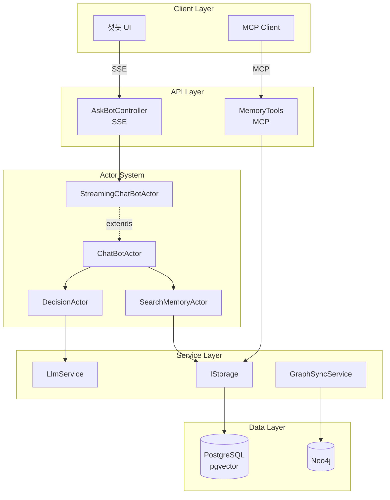
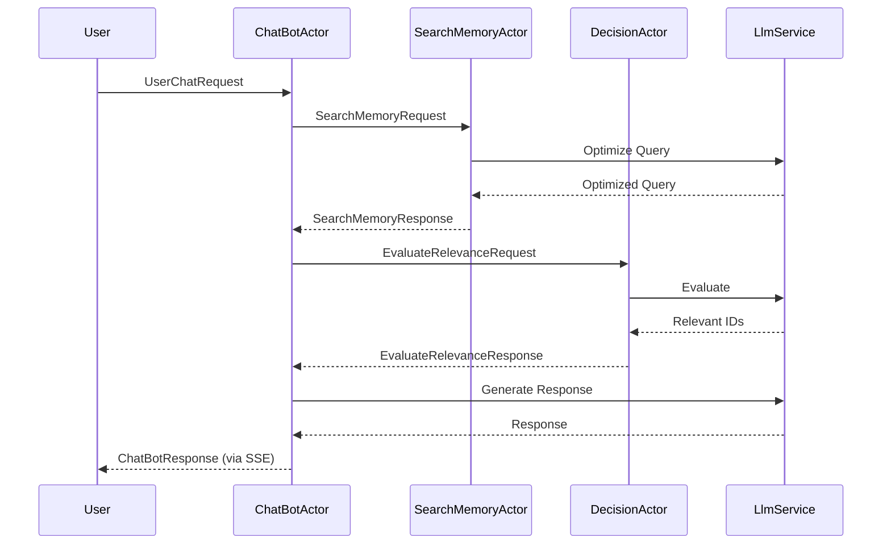

# Actor-Agent 기반 RAG 시스템 문서

## 소개

Memorizer-v1의 액터 모델 기반 챗봇 에이전트 시스템에 대한 종합 기술 문서입니다. 이 문서는 시스템의 아키텍처, 구현 세부사항, 그리고 향후 개선 방향을 다룹니다.

## 문서 구성

### 1. [전체 아키텍처 및 구성요소](./01-architecture.md)

시스템의 전반적인 구조와 각 레이어의 역할을 설명합니다.

**주요 내용**:
- 시스템 아키텍처 개요
- 레이어별 상세 설명 (Client, API, Actor, Service, Data)
- 데이터 흐름 및 시퀀스 다이어그램
- 핵심 기술 스택
- 주요 파일 위치

**대상 독자**: 시스템 전체 구조를 이해하고자 하는 개발자, 아키텍트

### 2. [MCP 기반 메모리 검색/저장 시스템](./02-mcp-memory-system.md)

Model Context Protocol을 통한 외부 통합과 메모리 시스템의 구현을 다룹니다.

**주요 내용**:
- MCP 도구 개요 및 사용법
- MemoryTools.cs 상세 분석
- 벡터 검색 (PostgreSQL + pgvector)
- 지식 그래프 (Neo4j)
- 프롬프트 템플릿
- 텔레메트리 및 로깅
- 사용 시나리오 및 모범 사례

**대상 독자**: MCP 통합을 이해하거나 메모리 시스템을 확장하고자 하는 개발자

### 3. [SSE와 액터 모델 연동: 실시간 스트리밍 챗봇](./03-sse-streaming.md)

Server-Sent Events와 Akka.NET 액터 시스템의 통합 구현을 설명합니다.

**주요 내용**:
- SSE 개념 및 선택 이유
- 시스템 아키텍처
- 서버 측 구현 (AskBotController, StreamingChatBotActor)
- 클라이언트 측 구현 (JavaScript, EventSource)
- 이벤트 타입 및 메시지 흐름
- 성능 최적화 (Channel, 다중 연결)
- 에러 처리 및 재연결
- UI 컴포넌트

**대상 독자**: 실시간 스트리밍 기능을 이해하거나 개선하고자 하는 프론트엔드/백엔드 개발자

### 4. [액터 모델 기반 챗봇 에이전트: 협업 구조와 프롬프트](./04-actor-collaboration.md)

Akka.NET 액터들의 역할과 협업 메커니즘, 그리고 각 액터가 사용하는 프롬프트를 상세히 다룹니다.

**주요 내용**:
- 액터 모델 기본 개념
- 액터 시스템 구조
- 액터별 상세 설명:
  - ChatBotActor (대화 관리자)
  - SearchMemoryActor (검색 전문가)
  - DecisionActor (관련성 평가자)
  - GraphRelationshipActor (그래프 관계 처리자)
- 메시지 흐름 및 협업 패턴
- Akka.NET 핵심 패턴 (Tell/Ask, Become, Supervisor)
- 프롬프트 설계 원칙

**대상 독자**: 액터 기반 시스템을 이해하거나 새로운 액터를 추가하고자 하는 개발자

### 5. [개선 제안 및 로드맵](./05-improvements-roadmap.md)

시스템의 현재 상태 분석과 향후 개선 방향을 제시합니다.

**주요 내용**:
- 현재 시스템 강점 분석
- 우선순위별 개선 제안:
  - 🚀 높은 우선순위: 검색 성능, 캐싱, 컨텍스트 관리
  - ⚡ 중간 우선순위: 멀티모달, 자동 그래프 구축, 품질 모니터링
  - 🔮 낮은 우선순위: 분산 시스템, 고급 RAG, 피드백 루프
- 기술 부채 해결 (테스트, 에러 처리, 문서화)
- Phase별 로드맵 (단기/중기/장기)
- 성능 목표

**대상 독자**: 프로젝트 매니저, 시니어 개발자, 아키텍트

## 빠른 시작

### 읽기 순서 (초보자)

1. **시스템 전체 이해**: [01-architecture.md](./01-architecture.md)
2. **MCP 사용법 학습**: [02-mcp-memory-system.md](./02-mcp-memory-system.md)
3. **실시간 기능 이해**: [03-sse-streaming.md](./03-sse-streaming.md)
4. **액터 협업 이해**: [04-actor-collaboration.md](./04-actor-collaboration.md)
5. **향후 계획 확인**: [05-improvements-roadmap.md](./05-improvements-roadmap.md)

### 읽기 순서 (경험자)

**백엔드 개발자**:
1. [01-architecture.md](./01-architecture.md) - 시스템 구조 파악
2. [04-actor-collaboration.md](./04-actor-collaboration.md) - 액터 시스템 이해
3. [05-improvements-roadmap.md](./05-improvements-roadmap.md) - 개선 영역 확인

**프론트엔드 개발자**:
1. [01-architecture.md](./01-architecture.md) - 전체 구조
2. [03-sse-streaming.md](./03-sse-streaming.md) - SSE 클라이언트 구현

**MCP 통합 개발자**:
1. [02-mcp-memory-system.md](./02-mcp-memory-system.md) - MCP 도구 상세
2. [01-architecture.md](./01-architecture.md) - 시스템 통합 포인트

## 핵심 다이어그램

### 시스템 아키텍처

### 메시지 흐름

## 주요 기술 스택

### 백엔드
- **프레임워크**: ASP.NET Core 8.0
- **액터 시스템**: Akka.NET
- **실시간 통신**: Server-Sent Events (SSE)
- **프로토콜**: Model Context Protocol (MCP)

### 데이터베이스
- **주 저장소**: PostgreSQL 16 + pgvector
- **그래프 DB**: Neo4j 5.x
- **캐싱**: Redis (계획 중)

### AI/ML
- **LLM**: OpenAI GPT-4, Anthropic Claude
- **임베딩**: text-embedding-ada-002 (1536차원)
- **벡터 검색**: pgvector (코사인 유사도)

### 프론트엔드
- **템플릿**: Razor Pages
- **JavaScript**: EventSource API, marked.js, mermaid.js
- **스타일**: Bootstrap 5

## 코드 탐색

### 핵심 파일 위치

**액터 시스템**:
- [ChatBotActor.cs](https://github.com/psmon/memorizer-v1/blob/dev/src/Memorizer/Actors/ChatBotActor.cs)
- [SearchMemoryActor.cs](https://github.com/psmon/memorizer-v1/blob/dev/src/Memorizer/Actors/SearchMemoryActor.cs)
- [DecisionActor.cs](https://github.com/psmon/memorizer-v1/blob/dev/src/Memorizer/Actors/DecisionActor.cs)
- [GraphRelationshipActor.cs](https://github.com/psmon/memorizer-v1/blob/dev/src/Memorizer/Actors/GraphRelationshipActor.cs)

**컨트롤러**:
- [AskBotController.cs](https://github.com/psmon/memorizer-v1/blob/dev/src/Memorizer/Controllers/AskBotController.cs) - SSE 스트리밍

**MCP 통합**:
- [MemoryTools.cs](https://github.com/psmon/memorizer-v1/blob/dev/src/Memorizer/Tools/MemoryTools.cs)

**프롬프트**:
- [PromptTemplates.cs](https://github.com/psmon/memorizer-v1/blob/dev/src/Memorizer/Prompts/PromptTemplates.cs)

**UI**:
- [Index.cshtml](https://github.com/psmon/memorizer-v1/blob/dev/src/Memorizer/Views/AskBot/Index.cshtml)

## 용어 정의

| 용어 | 설명 |
|-----|------|
| **RAG** | Retrieval-Augmented Generation - 검색 기반 생성 |
| **MCP** | Model Context Protocol - AI 도구 통합 프로토콜 |
| **SSE** | Server-Sent Events - 서버 푸시 이벤트 |
| **액터 모델** | 동시성을 위한 메시지 기반 계산 모델 |
| **Akka.NET** | .NET용 액터 프레임워크 |
| **pgvector** | PostgreSQL 벡터 검색 확장 |
| **임베딩** | 텍스트를 고차원 벡터로 변환한 것 |
| **유사도 검색** | 벡터 간 거리로 관련성을 찾는 검색 |
| **Cypher** | Neo4j 그래프 쿼리 언어 |

## 기여 가이드

### 새로운 액터 추가하기

1. `src/Memorizer/Actors/` 에 새 액터 클래스 생성
2. `ReceiveActor`를 상속받아 구현
3. 메시지 타입 정의 (Request/Response)
4. `Startup.cs`에서 액터 등록
5. 테스트 작성 (`Akka.TestKit` 사용)

### 새로운 MCP 도구 추가하기

1. `MemoryTools.cs`에 새 메서드 추가
2. `[McpServerTool]` 어트리뷰트 적용
3. 파라미터 문서화
4. 텔레메트리 추가 (`Activity` 사용)

### 문서 업데이트하기

1. 해당 섹션의 마크다운 파일 수정
2. Mermaid 다이어그램 업데이트 (필요 시)
3. GitHub 링크 확인 (`dev` 브랜치 사용)
4. 예제 코드 검증

## FAQ

**Q: 왜 액터 모델을 사용했나요?**

A: 분산 시스템의 동시성 처리와 상태 관리를 단순화하기 위함입니다. 각 세션이 독립된 액터로 관리되어 확장성과 결함 허용성이 뛰어납니다.

**Q: SSE 대신 WebSocket을 사용하지 않은 이유는?**

A: 챗봇의 경우 서버에서 클라이언트로의 단방향 스트리밍이 주요 요구사항이므로, 구현이 간단하고 자동 재연결을 지원하는 SSE가 더 적합합니다.

**Q: PostgreSQL과 Neo4j를 모두 사용하는 이유는?**

A: PostgreSQL은 벡터 검색과 트랜잭션 처리에 강점이 있고, Neo4j는 복잡한 관계 탐색에 최적화되어 있습니다. 각 DB의 장점을 활용하여 더 나은 사용자 경험을 제공합니다.

**Q: 메모리 검색 정확도를 높이려면?**

A: 1) 충분한 컨텍스트를 포함한 메모리 저장, 2) 적절한 태그 사용, 3) 관련 메모리 간 관계 생성, 4) 유사도 임계값 조정 (0.6~0.8)을 권장합니다.

## 관련 리소스

### 공식 문서
- [Akka.NET 문서](https://getakka.net/)
- [Model Context Protocol 명세](https://spec.modelcontextprotocol.io/)
- [pgvector 가이드](https://github.com/pgvector/pgvector)
- [Neo4j Cypher 매뉴얼](https://neo4j.com/docs/cypher-manual/)

### 참고 프로젝트
- [LangChain](https://github.com/langchain-ai/langchain) - RAG 프레임워크
- [Semantic Kernel](https://github.com/microsoft/semantic-kernel) - AI 오케스트레이션

### 논문 및 블로그
- [RAG 개선 기법](https://arxiv.org/abs/2312.10997)
- [Actor Model in Practice](https://www.infoq.com/articles/actor-model/)

## 라이선스

이 프로젝트는 MIT 라이선스를 따릅니다.

## 연락처

- GitHub: https://github.com/psmon/memorizer-v1
- Issues: https://github.com/psmon/memorizer-v1/issues

---

**마지막 업데이트**: 2025-01-27
**문서 버전**: 1.0.0
