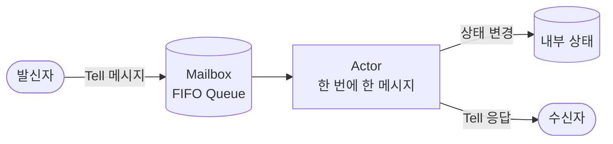
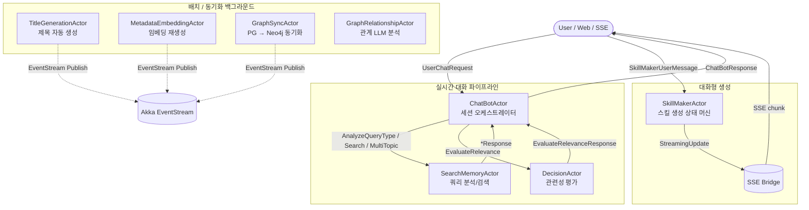
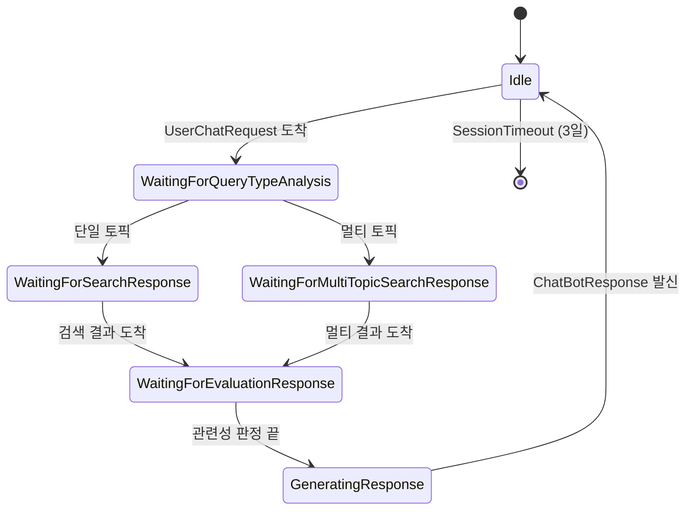
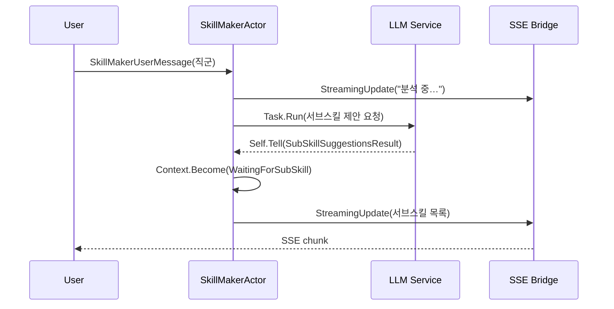

# Memorizer 액터 시스템 (Actor Model)

Memorizer 프로젝트는 [Akka.NET](https://getakka.net/) 기반의 **액터 모델**로 비동기/동시성 워크플로우를 구성합니다. 이 문서는 액터 모델을 처음 접하는 분도 따라올 수 있도록 **튜토리얼 형태**로 작성되었으며, 마지막에 **다음 개선 아이디어**를 누적해 갑니다.

---

## 1. 액터 모델이 뭔가요? (5분 튜토리얼)

### 1.1 한 줄 요약
> **"하나의 객체(액터) = 하나의 우편함(Mailbox) + 한 번에 하나의 메시지만 처리"**

전통적인 멀티스레드 코드는 `lock`, `mutex`, `semaphore`를 신경 써야 합니다. 액터 모델은 그 모든 걸 메시지 큐 하나로 단순화합니다.

### 1.2 핵심 개념 3가지

| 개념 | 설명 | 비유 |
|---|---|---|
| **Actor** | 상태와 행동을 가진 독립 단위 | 사무실의 직원 한 명 |
| **Message** | 액터끼리 주고받는 불변(immutable) 데이터 | 결재 서류 한 장 |
| **Mailbox** | 액터에게 도착한 메시지가 쌓이는 큐 | 직원 책상 위의 결재함 |



### 1.3 왜 이걸 씁니까?

- **동시성 안전**: 한 액터는 한 번에 한 메시지만 처리 → 내부 상태에 lock 불필요
- **장애 격리**: 한 액터가 죽어도 부모(Supervisor)가 재시작 가능
- **느슨한 결합**: 메시지로만 소통 → 액터를 분산 노드로 쪼개기 쉬움
- **상태 머신 표현**: `Context.Become`으로 "지금은 검색 대기 중", "지금은 평가 대기 중" 같은 단계를 자연스럽게 표현

### 1.4 가장 작은 샘플 코드

```csharp
using Akka.Actor;

// 1) 메시지 정의 (불변 record 권장)
public sealed record Greet(string Name);

// 2) 액터 정의
public class GreeterActor : ReceiveActor
{
    public GreeterActor()
    {
        // Greet 메시지가 오면 이 람다가 실행됨
        Receive<Greet>(msg =>
        {
            Console.WriteLine($"Hello, {msg.Name}!");
        });
    }
}

// 3) 사용
var system = ActorSystem.Create("demo");
var greeter = system.ActorOf(Props.Create(() => new GreeterActor()), "greeter");

greeter.Tell(new Greet("Memorizer")); // → "Hello, Memorizer!"
```

`Tell`은 **fire-and-forget**(보내고 잊음), `Ask`는 **응답을 Task로 받음**입니다. Memorizer는 대부분 `Tell` + `Sender.Tell(응답)` 패턴을 씁니다.

---

## 2. Memorizer가 액터를 쓰는 이유

이 프로젝트는 LLM 호출, 임베딩 생성, 그래프 동기화 등 **느리고 비동기적인 I/O**가 많습니다. 또한 사용자 세션마다 **대화 히스토리, 추론 단계, 멀티 토픽 컨텍스트**를 따로 들고 있어야 합니다.

→ "세션 = 액터 1개" 모델로 만들면 **세션 격리**, **타임아웃 자동화**, **단계별 상태 머신**이 자연스럽게 풀립니다.

---

## 3. 전체 액터 지도



---

## 4. 액터별 상세 설명

### 4.1 ChatBotActor — 세션 오케스트레이터

**역할:** 사용자 한 명의 세션을 책임집니다. 쿼리 분석 → 검색 → 평가 → 응답 생성을 단계별 **상태 머신**으로 진행합니다.

**왜 액터로 나눴나?**
- 사용자별 대화 히스토리를 lock 없이 안전하게 보관
- 3일 동안 메시지 없으면 `IWithTimers`로 자동 종료(`Context.Stop(Self)`)
- "지금 검색 대기 중인지 평가 대기 중인지"를 `Context.Become`으로 깔끔하게 표현

**핵심 상태 머신**



**실제 코드 발췌** (`ChatBotActor.cs:213-215`)

```csharp
// 1) 검색 액터로 분석 요청을 던지기 전에 "응답 대기 상태"로 전환
Context.Become(WaitingForQueryTypeAnalysis(request, originalSender));
_searchMemoryActor.Tell(analyzeRequest, Self);

// 2) 대기 상태의 Receive 람다는 "기대하는 응답 타입"만 처리
private Receive WaitingForQueryTypeAnalysis(UserChatRequest req, IActorRef sender)
{
    return message =>
    {
        if (message is AnalyzeQueryTypeResponse resp) { /* 다음 단계로 */ return true; }
        if (message is SessionTimeout)                { /* 종료 */      return true; }
        return false; // 그 외 메시지는 무시
    };
}
```

> 💡 **포인트:** `Become`은 "이 액터가 잠시 다른 모드가 된다"는 뜻이지, 새 액터가 만들어지는 게 아닙니다. 같은 메일박스, 다른 핸들러.

---

### 4.2 SearchMemoryActor — 검색 전문가

**역할:** 쿼리를 LLM으로 분석하고(단일/멀티 토픽), 키워드를 추출하고, 임베딩 벡터 검색을 수행합니다. 결과는 `Sender.Tell(...)`로 호출자에게 돌려줍니다.

**받는 메시지**
- `SearchMemoryRequest` — 단일 검색
- `AnalyzeQueryTypeRequest` — 토픽 개수 판단
- `MultiTopicSearchRequest` — 토픽별 병렬 검색

**왜 ChatBot과 분리했나?**
검색 로직이 무거워(LLM 2~3회 + DB) ChatBot 메일박스를 막으면 사용자 세션이 다른 메시지(타임아웃 리셋 등)에 늦게 반응합니다. **무거운 일은 별도 액터**로 빼는 게 액터 모델의 정석.

---

### 4.3 DecisionActor — 관련성 평가자

**역할:** ChatBot이 검색 결과를 받으면 "이게 정말 사용자 질문에 답이 되나?"를 LLM으로 한 번 더 판정합니다. 단일/멀티 토픽 두 가지 프롬프트를 갖고 있습니다.

```csharp
ReceiveAsync<EvaluateRelevanceRequest>(HandleEvaluateRelevanceRequest);
// → LLM 호출 → Sender.Tell(EvaluateRelevanceResponse)
```

**왜 분리?** 검색과 판정은 완전히 다른 책임이고, 향후 **판정 모델만 교체**(예: 더 빠른 모델)하기 위해서입니다.

---

### 4.4 GraphSyncActor — PG → Neo4j 동기화

**역할:** PostgreSQL의 모든 메모리를 Neo4j로 페이징 단위로 동기화합니다.

**핵심 패턴: Self.Tell 페이징 루프**

```csharp
// 한 페이지 처리 끝나면 자기 자신에게 다음 페이지 메시지를 보냄
Self.Tell(new ProcessMemoryForGraph { Page = state.Page + 1, ... });
```

이렇게 하면 **메일박스 큐를 활용해 협력적 멀티태스킹**이 됩니다. 페이지 간 다른 메시지(`GetGraphSyncStatus` 같은 상태 조회)가 끼어들 여지가 생겨, 진행률을 실시간 응답할 수 있습니다.

**완료 시 Akka EventStream 사용**
```csharp
Context.System.EventStream.Publish(new GraphSyncCompleted { ... });
```
구독자(예: SignalR 허브)는 누가 보냈는지 모르고 받기만 하면 됩니다 → **느슨한 결합**.

---

### 4.5 MetadataEmbeddingActor / TitleGenerationActor

같은 패턴(페이징 + Self.Tell + EventStream)으로 각각:
- **MetadataEmbedding** — 제목+태그 임베딩과 콘텐츠 임베딩 일괄 재생성
- **TitleGeneration** — 제목이 비어 있는 메모리에 LLM으로 제목 생성

배치 액터들은 **상태(BatchState)**를 한 인스턴스가 들고 있으니, "지금 몇 % 진행됐는지" 같은 질문을 메시지로 받아 즉시 답할 수 있습니다.

---

### 4.6 GraphRelationshipActor

LLM에게 "이 메모리는 다른 어떤 메모리와 어떤 관계로 연결돼야 하지?"를 물어보고, Neo4j에 관계 엣지를 만듭니다. `Sender.Tell`로 호출자에게 결과를 돌려주는 단순 요청-응답 액터.

---

### 4.7 SkillMakerActor — 대화형 스킬 생성

**역할:** Claude Skill을 사용자와 대화하며 만들어 줍니다. 직군 선택 → 서브스킬 제안 → 정보 수집 → 생성의 다단계.

**특징**
- `Context.Become`으로 단계 표현
- `Task.Run`으로 LLM 호출, 결과를 `Self.Tell`로 받아서 다시 메일박스로 → **외부 비동기와 액터의 단일 스레드 모델을 안전하게 결합**
- `_sseBridge.Tell(StreamingUpdate)`로 브라우저에 SSE 스트리밍



---

## 5. 자주 쓰이는 패턴 모음

### 5.1 메시지 정의는 항상 record로
```csharp
public sealed record SearchMemoryRequest
{
    public required string Query { get; init; }
    public required string SessionId { get; init; }
    public int MaxResults { get; init; } = 5;
}
```
**이유:** 불변이라 멀티 액터가 공유해도 안전. `init`으로 명시적 생성.

### 5.2 비동기 작업은 Task.Run + Self.Tell
```csharp
Task.Run(async () =>
{
    var result = await _llmService.CompleteAsync(prompt);
    Self.Tell(new MyTaskCompleted(result)); // 다시 메일박스로
});
```
**이유:** 액터 내부에서 `await` 도중 다른 메시지를 처리하면 상태가 꼬일 수 있어, 결과를 메시지로 다시 받아 단일 스레드 모델을 유지합니다. (ReceiveAsync도 가능하지만 긴 작업은 분리 권장)

### 5.3 타임아웃은 IWithTimers
```csharp
public class ChatBotActor : ReceiveActor, IWithTimers
{
    public ITimerScheduler Timers { get; set; } = null!;

    protected override void PreStart()
    {
        Timers.StartSingleTimer("session-timeout", new SessionTimeout(),
            TimeSpan.FromDays(3));
    }
}
```

### 5.4 브로드캐스트는 EventStream
```csharp
// 발행
Context.System.EventStream.Publish(new GraphSyncCompleted(...));

// 구독 (다른 액터에서)
Context.System.EventStream.Subscribe(Self, typeof(GraphSyncCompleted));
```

---

## 6. "처음 보는 사람"을 위한 미니 실습

ChatBotActor의 흐름을 60줄로 흉내 낸 데모입니다. 이 골격을 이해하면 실제 코드도 읽힙니다.

```csharp
public sealed record AskRequest(string Query);
public sealed record SearchRequest(string Query);
public sealed record SearchResponse(string Result);
public sealed record FinalAnswer(string Answer);

public class MiniSearchActor : ReceiveActor
{
    public MiniSearchActor()
    {
        Receive<SearchRequest>(req =>
        {
            // 가짜 검색
            Sender.Tell(new SearchResponse($"[result of {req.Query}]"));
        });
    }
}

public class MiniChatBotActor : ReceiveActor
{
    private readonly IActorRef _search;
    public MiniChatBotActor(IActorRef search)
    {
        _search = search;
        Receive<AskRequest>(HandleAsk);
    }

    private void HandleAsk(AskRequest req)
    {
        var originalSender = Sender; // ⚠️ 비동기 후에 Sender가 바뀔 수 있어 캡처
        Context.Become(WaitingForSearch(originalSender));
        _search.Tell(new SearchRequest(req.Query));
    }

    private Receive WaitingForSearch(IActorRef sender) => msg =>
    {
        if (msg is SearchResponse r)
        {
            sender.Tell(new FinalAnswer($"답: {r.Result}"));
            Context.Become(Receive); // 원래 핸들러로 복귀
            return true;
        }
        return false;
    };
}

// 실행
var sys = ActorSystem.Create("mini");
var search = sys.ActorOf(Props.Create(() => new MiniSearchActor()));
var bot = sys.ActorOf(Props.Create(() => new MiniChatBotActor(search)));

var ans = await bot.Ask<FinalAnswer>(new AskRequest("hello"));
Console.WriteLine(ans.Answer); // → 답: [result of hello]
```

---

## 7. 안티패턴 — 하지 말아야 할 것

| 하지 말 것 | 왜? | 대안 |
|---|---|---|
| 액터 안에서 `Thread.Sleep` | 메일박스가 막혀 다른 메시지가 멈춤 | `Timers.StartSingleTimer` |
| `await`로 LLM을 직접 기다림 (긴 작업) | 다른 메시지 처리 지연 | `Task.Run` + `Self.Tell` 패턴 |
| 가변(Mutable) 메시지 객체 공유 | 동시성 안전 깨짐 | `record` + `init` |
| Sender를 비동기 콜백 안에서 그대로 사용 | 다음 메시지 처리 후엔 Sender가 바뀜 | 핸들러 진입 시점에 변수로 캡처 |
| 액터끼리 직접 객체 참조 호출 | 메시지 모델 우회 → 락 필요 | 항상 `Tell`/`Ask` |

---

## 8. 다음 개선 아이디어 (✏️ 지속 업데이트)

> 이 섹션은 액터 모델 적용을 발전시키기 위한 **살아있는 백로그**입니다. 새 아이디어가 떠오르면 위에서 추가하고, 적용된 항목은 ✅ 표시 후 별도 항목에 적용 PR/커밋을 남깁니다.

### 단기 (1~2주)
- [ ] **DeadLetter 모니터링** — 잘못된 상태에서 무시된 메시지를 EventStream으로 수집해 로그/대시보드로 노출
- [ ] **Ask 타임아웃 일관화** — `Ask<T>` 호출에 공통 타임아웃 정책 도입(예: 30s 디폴트, LLM 콜은 90s)
- [ ] **공통 BaseActor** — `IWithTimers` + 공통 로깅/세션 타임아웃 로직을 추상 클래스로 추출 (ChatBot/SkillMaker 중복 제거)

### 중기 (1~2개월)
- [ ] **Supervision 전략 명시화** — 현재 기본 전략 사용. `OneForOneStrategy`로 LLM 일시 장애 시 N회 재시도 후 Stop 정책 명시
- [ ] **Streaming 메시지 표준화** — SkillMaker의 `SkillMakerStreamingUpdate`와 ChatBot의 `_reasoningSteps`를 공통 `IStreamingEvent` 인터페이스로 통일
- [ ] **상태 머신 → Akka.FSM 검토** — `Context.Become` 분기가 길어진 ChatBotActor를 [Akka.FSM](https://getakka.net/articles/actors/finite-state-machine.html)으로 리팩터해 가독성 개선
- [ ] **배치 액터 백프레셔** — GraphSync/MetadataEmbedding이 한꺼번에 Self.Tell 폭주 시 큐가 부풀 위험. `WorkPullingPattern` 또는 throttle 도입

### 장기 (3개월+)
- [ ] **Cluster Sharding** — 세션 액터(ChatBot/SkillMaker)를 [Akka.Cluster.Sharding](https://getakka.net/articles/clustering/cluster-sharding.html)으로 노드 간 분산. 한 프로세스 메모리 한계 돌파
- [ ] **Persistence (Event Sourcing)** — 대화 히스토리·진행 단계를 Akka.Persistence로 저장 → 프로세스 재시작 후 세션 복원
- [ ] **DI 통합 정리** — 액터 생성 시 `Akka.DependencyInjection` 또는 `Akka.Hosting`으로 통일 (현재 일부 수동 주입)
- [ ] **테스트 커버리지** — `Akka.TestKit.Xunit2` 기반 메시지 흐름 단위 테스트 셋 (특히 ChatBot 상태 머신 분기)
- [ ] **OpenTelemetry 액터 트레이싱** — 메시지 단위로 trace span 발행, "사용자 요청 → 검색 → 평가 → 응답" 전 구간 가시화

### 연구/실험
- [ ] **DecisionActor 경량화** — 더 작은 모델로 1차 필터링 + 본 모델로 재판정하는 2-stage 파이프라인
- [ ] **Reactive Streams 통합** — `Akka.Streams`로 GraphSync 페이징을 더 선언적으로 표현
- [ ] **Kakashi Harness 연계** — 액터별 평가 로그를 카카시 하네스에 자동 등록하는 EventStream 구독자 액터

---

## 9. 참고 링크

- [Akka.NET 공식 문서](https://getakka.net/)
- [The Reactive Manifesto](https://www.reactivemanifesto.org/)
- 프로젝트 내 액터 관련 스킬: `.claude/skills/actor-model/SKILL.md`

---

**문서 메타**
- 최초 작성: 2026-05-10
- 다음 리뷰 권장: 새로운 액터 추가 시 / "다음 개선 아이디어" 항목 적용 시
